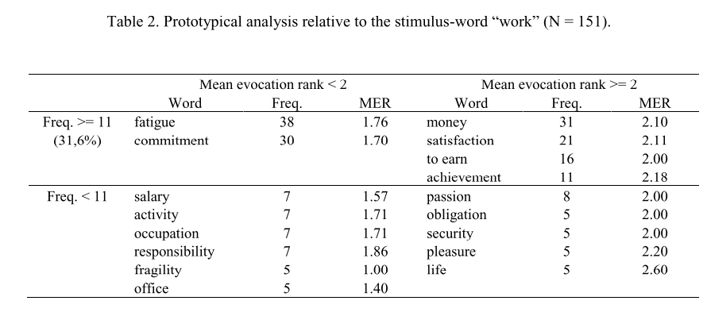

# Análisis de datos con R

En este capítulos nos introduciremos al ciclo de trabajo del análisis de datos, así como al lenguaje R. Particularmente, vamos a aprender a:

1. cargar datos y recursos;
2. explorar y familiarizarnos con los datos y su estructura;
3. transformar los datos para limpiarlos y que tengan la estructura óptima para nuestros análisis;
4. hacer nuestros primeros gráficos;
5. generar nuestras propias funciones.

Trabajaremos con un dataset de asociaciones libres a la palabra "Big data". Este es un dataset construido a partir de una breve encuesta con la siguiente consigna: *Por favor, indicanos qué palabras o frases te vienen a la mente cuando pensás en "big data". También te pedimos que, por favor, nos indiques si estas ideas que acabas de introducir se corresponden con algo que valoras positivamente (algo que te agrada) o negativamente (algo que te desagrada)"*. Además, hemos registrado el orden en que cada palabra fue introducida por el participante (un valor generalmente entre 1 a 5, aunque los participantes podían ingresar más palabras).

Con este dataset, y a través de las tareas señaladas, vamos a intentar responder **cuál es el sentido común en torno al big data**. Esto nos ubica en las coordenadas de la psicología social, particularmente de la *teoría de la representación social*, a la que nos acercaremos siguiendo la variante estructural de @Abric2001, y recurriendo a técnicas cuantitativas. Hacia el final del capítulo recrearemos el "análisis prototípico" de esta teoría y discutiremos la interpretación de los resultados.

## Cargar datos y recursos

Lo primero que haremos es cargar algunas librerias (`package`) que van a poner a nuestra disposición un conjunto de funciones que utilizaremos a lo largo de todo el ejercicio. Recordá que una función es una secuencia de comandos que se aplican a un objeto que se le pasa a la función, referenciándolo entre sus paréntesis. Por ejemplo, utilizaremos la función `library()` y el nombre de las librerías para habilitar las funciones de `readr` para importar datos, y el conjunto de librerías del `tidyverse` para manipular y visualizar. 

Luego importaremos los datos con la función `read_csv()` de la librería `readr`. En RStudio podés listar a las funciones de un paquete si tipeas su nombre seguido de "::". Esta forma de vincular paquetes y funciones es recomendada, en tanto los nombres de las funciones pueden pisarse, dependiendo del orden en que cargamos los paquetes.

Nos interesa que esos datos importados se guarden como un objeto en memoria, ya que estaremos trabajando con ellos en lo que sigue. Para ello, utilizamos un operador de asignación ` <- `, precedido del nombre que le daremos al objeto (en nuestro caso `asociaciones`).

<!-- 2do: definir fuente de datos -->

```{r echo=TRUE, message=FALSE, warning=FALSE}
# para cargar una libreria primero hay que instalarla:
# install.packages("readr")
# install.packages("tidyverse")

library(readr) # vamos a cargar las librerias
library(tidyverse) 

asociaciones <- readr::read_csv(file = "https://raw.githubusercontent.com/gastonbecerra/curso-intro-r/main/data/asociaciones.csv")
```

## Explorar los datos

El objetivo del momento de exploración de los datos es familiarizarnos con la estructura de los datos, y transformarlos para poder realizar nuestros análisis. Por lo general, aquí se empiezan a decidir las tareas de *limpieza*. 

Lo primero que vamos a hacer es ver el tamaño de la tabla con `dim()`, y los primeros registros con `head()`. 

Esto nos va a permitir saber:

* la cantidad de registros y columnas;
* los nombres de las columnas y su tipo de dato;
* el contenido de los primeros registros.

```{r}
dim(asociaciones)
head(asociaciones, n = 10) 
```

Por lo que podemos ver, tenemos 4 columas: `id` y `palabra` son variables de texto (`<chr>`), mientras `orden` y `valoracion` son numéricas. Otro posible tipo de columna es el `factor` (`<fct>`) que sirve para registrar categorías, donde cada valor posible es un `level`.

Podemos ver que el valor de `id` se repite entre filas, lo que nos da la pauta que varios registros corresponden naturalmente juntos. En este caso, se tratan de las distintas palabras mencionadas por un mismo participante frente a "big data". Este diseño de tabla donde hay `n registros x 1 participante`, a diferencia de tener sólo registro con muchas columnas tiene muchas ventajas. Por el momento señalemos sólo 1: todas nuestras palabras quedan en la misma columna, de modo que si queremos procesarlas será muy fácil referenciarlas. Cada palabra propuesta tiene, además, el orden de evocación (`orden`) y la valoración dada (`valoracion`).

Luego, es útil tener una idea de los valores posibles de las distintas columnas o variables. `summary` nos devuelve un resumen de estadísticas descriptivas, que nos permite saber, por ejemplo, en qué rango se registran las valoraciones, o cómo se distribuyen los ordenes de evocación.

```{r message=TRUE, warning=FALSE}
summary(asociaciones)
```

Otras tareas que nos pueden interesar en el análisis exploratorios son:

* ver la cantidad de datos vacíos
* ver la cantidad de datos redundantes
* ver relaciones entre variables
* graficar el rango de valores de una o más variables

Muchas de estas tareas se pueden hacer con [distintos packages](https://www.groundai.com/project/the-landscape-of-r-packages-for-automated-exploratory-data-analysis/1).

Recordá que podes ver la tabla, como si estuvieras viendo una planilla, con `view(asociaciones)`.

## Transformar, visualizar y limpiar

Ahora vamos a ver de qué manera podemos transformar los datos para obtener respuestas a las siguientes preguntas:

1. ¿cuáles son las palabras más frecuentes?
2. ¿cuáles son las palabras con valoraciones más extremas?
3. ¿cuáles son las palabras que se evocaron más rápido?

Para responder esto vamos a utilizar verbos de manipulación (de `dplyr`, una librería incluida en `tidyverse') sobre nuestra tabla. Algunos de estos verbos son:

* `filter()` para filtrar los registos/observaciones por alguna condición de sus valores;
* `mutate()` para agregar una columna/variable con el resultado de alguna operación sobre otras columnas;
* `group_by()` y `summarise()` para realizar alguna operación sobre los datos de distintos registros, *reduciendolos* en uno sólo por grupos;
* `n()` que nos devuelve el conjunto de registros de un grupo (y que por ello se hace luego de `group_by()`); algo que podemos simplificar con `count()`;
* `arrange()` ordena los datos ascendente o descendentemente;

Luego, para encadenar estas acciones vamos a utlizar un operador denominado *pipe* (`%>%`) que funciona como un *tubo*: toma el objeto a su izquierda y lo hace pasar por la función a su derecha, devolviendonos el resultado. 
Esto nos permite una manera más fácil de pensar a la hora de escribir el código para manipular un objeto, que su alternativa de incluir al objeto entre los paréntesis de una función, ya que en primer lugar lo mencionamos y luego iremos paso a paso introduciendole transformaciones.

Antes que nada, empecemos por *chusmear* (`glimpse`) la estructura de la base para recordar las columnas/variables con las que podemos trabajar. Los nombres de las columnas aparecen precedidos con un `$`, una debajo de la otra, para que sea más facil de observar tablas largas. Luego, nos informa el tipo de variable y nos permite ver los primeros valores (que en entran en pantalla)

Nuestra tabla tiene las palabras que los participantes respondieron en la columna `asociaciones$palabra`, el orden en que dichas palabras fueron ingresadas por el participante en `asociaciones$orden`, y una valoración sobre esa palabra expresada en forma númerica en `asociaciones$valoracion`. 

Tenemos todos los elementos para responder las preguntas. Sólo falta diseñar un camino de operaciones para visibilizar la respuesta:

(Paso1) vamos a tomar la tabla que nos interesa `asociaciones`, y la vamos a pasar, para...
(Paso2) ...armar grupos de registros que compartan el valor en `asociaciones$palabra`, y para cada cual vamos a:
(Paso3) contar la cantidad de registros (dandonos la frecuencia con que dicha palabra fue asociada a big data);
(Paso4) y calcular la media de las valoraciones en `asociaciones$valoracion`,
(Paso5) así como la media del orden en que fue evocado (`asociaciones$orden`)
(Paso0) ... el resultado de esta operación la vamos a guardar en una tabla nueva, que luego operaremos para responder nuestras 2 preguntas. En tanto esta tabla *describe* la información de la anterior, notaremos que tiene muchos menos registros.

Para estas operaciones vamos a usar los comandos recién vistos:

```{r message=TRUE, warning=FALSE}
glimpse(asociaciones) # muestra la estructura de la tabla 

asoc_frecuentes <- asociaciones %>% # (Paso0) y (Paso1)
  group_by(palabra) %>% # (Paso2)
  summarize( 
    freq = n(), # (Paso3)
    valoracion_media = mean(valoracion), # (Paso4)
    orden_media = mean(orden) #(Paso5)
  )

glimpse(asoc_frecuentes) 
```

Más sintéticamente podríamos usar `tally()` o `count()`. Recordá que podés obtener ayuda sobre estos comando ejecutando `?tally()`.

Si ordenamos esta tabla ya estamos en condiciones de indicar cuáles son las palabras más/menos frecuentes. 
Para esto vamos a usar `slice_max()`, que ordena los datos y los corta en alguna posición.

```{r message=TRUE, warning=FALSE}
asoc_frecuentes %>%  # no guardamos el resultado, solo lo imprimimos
  slice_max(order_by = freq, n=10) # ordenamos por freq y cortamos en 10 registros
```

La palabra más evocada fue "información", junto con un conjunto de otras palabras que podemos decir que remiten al manejo de los datos mediados por la tecnología, con diversos productos, como puede ser el análisis de información y la generación de conocimiento, o la manipulación y el control (las únicas palabras que tienen una valoración negativa).

Para conocer las palabras más/menos valoradas deberemos generar otros cortes.

```{r message=TRUE, warning=FALSE}
asoc_frecuentes %>%  
  slice_max(order_by = valoracion_media, n=10) # las de valor mas alto

asoc_frecuentes %>%  
  slice_min(order_by = valoracion_media, n=10) # las de valor mas bajo
```

Más allá de que se puede inferir ciertos temas en las palabras (especialmente las negativas), nos debemos preguntar si tiene sentido trabajar con ideas y expresiones idiosincráticas, introducidos por un sólo participante. A fin de cuentas, la pregunta que guía toda nuestra exploración es sobre lso sentidos *comunes* o *compartidos*.
Podemos entonces establecer un umbral o mínimo de repeticiones para que una palabra nos resulte relevante o informativa. 

Miremos entonces las frecuencias. Otra vez, diseñemos un camino de operaciones:

(Paso1) vamos a tomar la tabla que nos interesa `asoc_frecuentes`, y la vamos a pasar, para...
(Paso2) ...armar grupos de registros que compartan el valor en `asociaciones$freq`, y para cada cual vamos a:
(Paso3) contar la cantidad de registros (dandonos la cantidad de palabras que fueron dicha la misma cantidad de veces);
(Paso4) vamos a visualizarlo en un gráfico de puntos que cruce la frecuencia y la cantidad de palabras. 

Por su parte, el diseño del gráfico va a requerir 3 componentes (mínimos): que insertemos datos (en este caso, vamos a estar pasando la tabla hecha hasta el paso 3 con un pipe, de modo que no necesitamos declararla de nuevo), que mapeemos algunos de esos datos a propiedades visuales del gráfico (como por ejemplo, un cierta columna/variable para un eje del gráfico), y que elijamos un sistema de representación o "geometry" (puntos, barras, áreas, etc.)

```{r message=TRUE, warning=FALSE}
asoc_frecuentes %>% # Paso1
  group_by(freq) %>% # Paso2
  summarize(cant_palabras = n()) %>% # Paso3
  ggplot( # Paso 4: usamos la librería ggplot2 y la función ggplot
    aes(x=cant_palabras,y=freq) # mapeeamos los datos en los ejes x e y
    ) + # los componentes de ggplot se concatenan con +, ya que no son pasos secuenciales
  geom_point()
```

Por lo visto, tenemos una distribución que sigue la [ley de Zipf](https://es.wikipedia.org/wiki/Ley_de_Zipf): muy poca cantidad de palabras tienen valores que se repiten muchas veces (los sentidos más comúnes), y hay casi 700 palabras que se repiten 1 sola vez. En vistas de esto podemos quedarnos con las palabras que se repiten más de 1 vez, criterio que utilizaremos para establecer un filtro (`filter()`). En esta ocasión, por simpleza, vamos a "pisar" nuestra tabla de datos con un fragmento de ella misma.

```{r message=TRUE, warning=FALSE}
asoc_frecuentes <- asoc_frecuentes %>% # vamos a pisar la tabla con el resultado
  filter(freq > 1)

glimpse(asoc_frecuentes)
```

Con este nuevo dataset deberíamos repetir los análisis anteriores sobre las palabras mas/menos valoradas. Este es un escenario al que deberemos acostrumbrarnos: **el proceso de transformación-visualización-limpieza es iterativo**. En la medida en que nos familiaricemos más con nuestros datos, que aclaremos nuestras preguntas, y que decidamos y programemos los análisis, deberemos repetirnos varias veces. 

Por últimos, nos queda indagar cuáles son las palabras que más rápidamente fueron evocadas en la encuesta, es decir, las que tiene un orden de evocación más cercano a 1. Estas son las ideas que probablemente sean las más accesibles y memorables. Pero ahora en lugar de una lista, veamos un gráfico en el que podamos incluir otra información: la valoración media de la palabra.

<!-- 2do: dar vuelta este analisis: el grafico para valoraciones, y la tabla boluda para orden -->

```{r message=TRUE, warning=FALSE}
asoc_frecuentes %>% 
    slice_min(order_by = orden_media, n=10) %>% # las de valor mas bajo
  ggplot( # vamos a usar ggplot para graficar
    aes( # dentro de aes indicamos las variables a vincular con las partes del gráfico
      y = palabra,
      x = orden_media,
      fill = valoracion_media
    )
  ) + 
  geom_col()
```

Estos primeros análisis ya nos dan una idea de la estructura de los datos, y algunas pistas sobre las respuestas. En lo que sigue vamos a poner todas estas operaciones juntas, con algunos pasitos extras, para poder hacer un *análiasis prototípico* según la *teoría de la representación social*.

## Funciones

En este apartado vamos a juntar estas operaciones de modo tal que nos permita realizar un *análiasis prototípico*, siguiendo el modelo estructural de @Abric2001 para la *teoría de la representación social*. Esta teoría supone que las representaciones se compone, por un lado, de un núcleo central que aúna los sentidos más comunes y estables de la representación, y por el otro, de elementos periféricos que concretizan la representación y la vinculan a los distintos contextos específicos de su uso. 

**¿Cómo se calcula?** Este análisis consiste en dividir las palabras evocadas en 4 -o más- segmentos, según su frecuencia y rango de evocación, y utilizando alguna medida estadística de estos valores como criterio de corte. Esto nos dejará un cuadro que cruza las palabras mas y menos frecuentes, y las evocadas más y menos rápidamente. Estos 4 segmentos suelen ser interpretados como el núcleo de la representación, sus elementos periféricos y dinámicos, y sus manifestaciones singulares e idiosincráticas. Sin embargo, vale la aclaración de @Wachelke2011: 

> In a strict sense, prototypical analysis is a convention for the presentation of data, not a standard statistical analysis. It is not a procedure that involves the calculation of parameters and significance levels, but a pattern for the organization of information relative to the evocation of verbal forms in a summarized way. 

Una decisión importante para este análisis es el criterio para establecer los cortes entre segmentos, aspecto que no tiene consensos en la literatura [@Dany2014]: algunos usan la media, otros la mediana, y otros alguna función pensada para una distribución como la de ley de Zipf. Otra decisión importante es la de utilizar algún umbral o mínimo de frecuencia para achicar el corpus. 

Aquí vamos a "empaquetar" las operaciones necesarias para el análisis en una función, con una serie de parámetros (inputs) y un valor de salida (output). Esto nos va a permitir fácilmente probar distintos parametros para las decisiones que debemos tomar, sin tener que volver a escribir el código de las operaciones. 

Para crear una funcion vamos a utilizar `function()` incluyendo los parametros que esperamos entre los paréntesis. Vamos a guardar la función en un objeto (y así le vamos a dar un nombre que podamos invocar después) con `<-`.

```{r}
analisis_proto <- function (tabla_evocaciones) {
  
  # las operaciones van aca...
  # por ahora no vamos a hacer nada mas que asignar nuestro input a un nuevo objeto...
  objeto_a_devolver <- tabla_evocaciones 
  
  return(objeto_a_devolver) # ... y lo devolvemos
}
```

Podemos llamar a la función con `analisis_proto(asociaciones)`. Dada las operaciones que le definimos dentro, no nos debe sorprender que la función no haga más que llamar al objeto. 

```{r}
analisis_proto(asociaciones) 
```

Es importante notar una cosa. Si prestamos atención al entorno, vamos a ver que el `objeto_a_devolver` no aparece en nuestra lista de objetos. Esto es porque quedó "encapsulado" en la función, y no está disponible por fuera de ella. Lo mismo puede decirse de `tabla_evocaciones`, que es la forma en que en la función llamamos a nuestro primer parámetro (los datos).

Aclarada la estructura y el uso de una función, ya sólo resta pensar en cuáles son los pasos a seguir para realizar el *análiasis prototípico*. Para eso, volvamos a la definición más arriba, y pensemos la secuencia de operaciones que necesitamos:

(paso 1) primero debemos calcular las frecuencias de cada palabra y sus medias de valoracion y orden; 
(paso 2) deberemos definir una frecuencia mínima;
(paso 3) vamos a calcular los criterios de corte para distinguir los mas/menos frecuentes y los evocados mas/menos rápidamente;
(paso 4) vamos a utilizar estos criterios de corte para segmentar las asociaciones, indicando qué palabras corresponden a qué segmento;

Como la idea es poder probar distintos criterios y decisiones, algunos de estos pasos suponen que podamos introducir algún parámetro: 
(paso 2) vamos a introducir una frecuencia mínima;
(paso 3) vamos a indicar si queremos usar la media o la mediana para calcular el criterio de corte, es decir si aplicamos `mean()` o `median()`, esta operación condicional la haremos con una estructura de control: `if( criterio ) { ... } else { ... }`.
Estos 2 parámetros los vamos a incluir en la función, con un valor por defecto: `2` para la frecuencia mínima, y `media` para calcular el criterio.
Vamos a utilizar el comando `message()` para que al correr la función se muestren estos parámetros, y también para observar la cantidad de palabras que quedan en cada segmento, dados estos parametros (paso 5).

```{r}
analisis_proto <- function (tabla_evocaciones, frecuencia_minima = 2,  criterio_corte = "media") {
  
  # (paso 1) tabla de frecuencias
  asoc_frecuentes <- asociaciones %>% 
    group_by(palabra) %>% 
    summarize( 
      freq = n(), 
      valoracion_media = mean(valoracion), 
      orden_media = mean(orden) 
    )  
  
  # (paso 2) establecemos un umbral de frecuencia minima (usando parametro)
  asoc_frecuentes <- asoc_frecuentes %>% 
    filter(freq > frecuencia_minima) 
  message("frecuencia minima = ", frecuencia_minima)
    
  # (paso 3) calculamos el corte de frecuencia (usamos mean o median, segun parametro)
  if (criterio_corte == "media") {
    freq_cut <- mean(asoc_frecuentes$freq) 
    orden_cut <- mean(asoc_frecuentes$orden_media) 
  } else {
    freq_cut <- median(asoc_frecuentes$freq) 
    orden_cut <- median(asoc_frecuentes$orden_media) 
  }
  message("valor corte frecuencia = ", freq_cut)
  message("valor corte orden = ", orden_cut)
  
  # (paso 4) segmentamos las palabras
  prototipico <- asoc_frecuentes %>% mutate( segmento = case_when(
    freq >= freq_cut & orden_media < orden_cut ~ 1,
    freq >= freq_cut & orden_media >= orden_cut ~ 2,
    freq < freq_cut & orden_media < orden_cut ~ 3,
    freq < freq_cut & orden_media >= orden_cut ~ 4 
  )
  ) %>% arrange(segmento, desc(freq,orden_media))
  
  # (paso 5) vamos a contar las palabras en cada segmento y lo mostramos en pantalla
  palabras_por_segmento <- prototipico %>% 
    count(segmento) %>%
    pull(n) # pull extrae una variable, quedando como vector
  message("palabras en cada segmento = ", 
          paste(palabras_por_segmento, collapse = " | "))
  
  # ... y lo devolvemos
  return(prototipico) 
}
```

Veamos el objeto que nos devuelve, por ahora con los valores por defecto:

```{r}
analisis_proto(tabla_evocaciones = asociaciones)
```

Ahora podemos probar otros parámetros: 

```{r}
analisis_proto(tabla_evocaciones = asociaciones, frecuencia_minima = 3, criterio_corte = "mediana")
```

Otra vez, es hora de tomar decisiones. Como vemos, esta última configuración logra quedarse con menos palabras, pero a la vez incrementa el tamaño del 1er segmento, que dado que es donde iremos a buscar los sentidos centrales, conviene que sea más pequeño. Podemos asumir que un umbral de frecuencia mínimas más alto, y una división por medias debería dar un conjnto más chico de palabras en el segmento 1, y menos palabras en total.

```{r}
analisis_proto(tabla_evocaciones = asociaciones, frecuencia_minima = 5, criterio_corte = "media")
```

Va tomando forma! 

## Interpretación

Siguiendo el *análisis prototípico*, nos interesan las asociaciones registradas con una frecuencia mayor y un rango por debajo de la media, es decir, las más frecuentes y salienten, ya que son las principales candidatas a expresar los sentidos más centrales y consensuados de la representación. En nuestra tabla serían aquellos registros con `segmento == 1`.

En @Becerra2020 con un dataset muy similar a este sugeríamos:

> El primer segmento comprende a las palabras enunciadas más frecuentemente y de más rápida evocación, es decir, las más comunes y accesibles. Estos son los términos que se puede decir que constituyen el núcleo de la representación: información, dato, internet, control, grande, bases de datos, manipulación, conocimiento, marketing, poder, computadora, espionaje, y grandes datos. Mayormente refieren a lo que denominamos la “premisa” del big data: la disponibilidad de grandes bases de datos, plausibles de otorgar información. Es interesante señalar que el término grande (lemma en el que convergen distintos términos, tales como grandes, mucho) es el único en el núcleo que remite a las famosas 3 V’s –volumen, velocidad y variedad– que popularizara Laney y que se referencia en prácticamente todas las noticias que buscan introducir al big data a un público masivo ...

> Mayormente estos términos están asociados con una valoración positiva, ... siendo conocimiento la palabra de mayor valor medio ... Sin embargo, también aparecen en este mismo segmento, las 3 palabras de menor valoración en todo el corpus: manipulación, espionaje y control. ... La distribución de estas valoraciones es indicativa de la polaridad que recubre el campo semántico del big data, en tanto la imagen de la “gran oportunidad” que ofrece su promesa epistémica, convive con una retórica de sospecha frente a los riesgos de su explotación para el sometimiento y el condicionamiento de otros, como un “gran hermano”.

Veamos una tabla típica con las que se suelen mostrar estos análisis prototípicos. El sigiuente es un ejemplo tomado de @Wachelke2011, sobre un estudio de las RS sobre el trabajo.



El cuadro está compuesto por 4 cuadrantes, resultante de ordenar las palabras por frecuencia y orden de evocación, ambas cortadas en 2 segmentos por el punto medio. La tabla es clara en segmentar palabras, aunque no hay manera fácil de identificar los segmentos si no es comparando frecuencias. Además, si quisierámos agregar una variable, como es valoración en nuestro caso, las tablas se vuelven extensas para compararlas. 

Un gráfico debería debería permitirnos visualizar esto mejor!

Vamos a dibujar un gráfico que:
* permita dibujar puntos en el cruce de frecuencia (X) y orden de evocación (Y),
* que incluya las palabras en el gráfico, de modo tal que podamos leerlas por grupitos,
* que señale con color la valoración,
* que muestre los puntos de corte en frecuencia (X) y orden de evocación (Y),
* y que remarque el cuadrante del núcleo central.

```{r}
prototipico <- analisis_proto(tabla_evocaciones = asociaciones, frecuencia_minima = 5, criterio_corte = "media")
glimpse(prototipico)

prototipico %>%
  ggplot(aes(x=freq,y=orden_media,label=palabra)) + # frecuencia x orden
  scale_x_continuous(trans='log') + # vamos a aplicar una transformación al eje X para ver mejor los puntos
  geom_hline(yintercept = 2.87623694419952, linetype = 2) + # tomamos este valor del mensaje de la función
  geom_vline(xintercept = 15.219512195122, linetype = 2) +  # tomamos este valor del mensaje de la función
  geom_point(aes(size=freq, colour=valoracion_media), show.legend = TRUE) + # agregamos los puntos
  scale_colour_gradient(low = "red", high = "green", na.value = NA) + # gama de colores para valores continuos
  geom_text( aes(size=20, colour=valoracion_media), fontface = "bold",
             show.legend = FALSE, nudge_y = -.1, check_overlap = TRUE) + # agregamos las palabras
  labs(y="Orden de evocación", x = "Frecuencia (log)") +
  theme_minimal()

```
