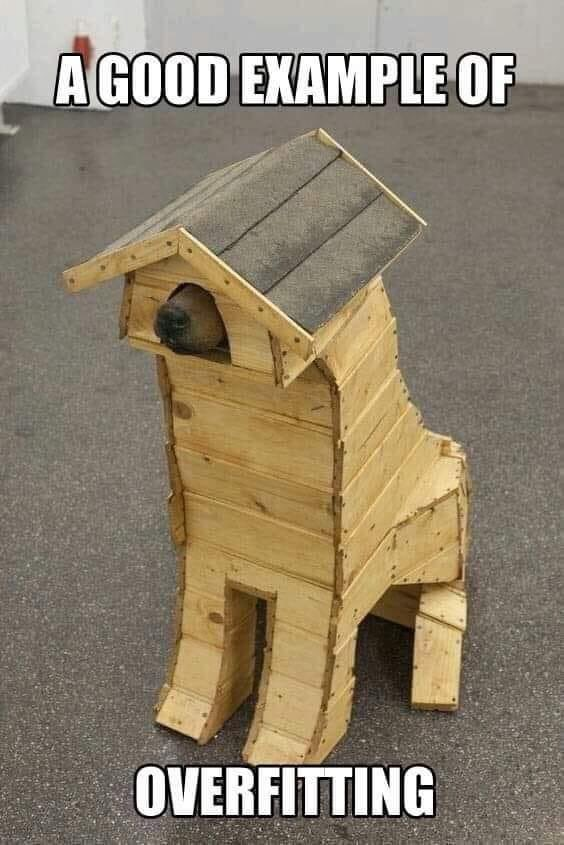

# Clasificar automáticamente 

En este capítulo nos introduciremos a una técnica de "aprendizaje supervisado". Nos referimos así a algoritmos que, a partir de datos que ya están clasificados o catalogados de antemano por medio de alguna variable (“datos etiquetados”), buscan inferir reglas para clasificar otros registros. 
Lo interesante de este tipo tareas es que nosotros no estamos introduciendo *reglas explícitas* sino que nuestro modelo resultará de registrar patrones diferenciales para las clases de datos que servimos.
Esta tarea se considera "supervisada" porque somos nosotros los que le indicamos previamente qué es lo que está observando/aprendiendo. 

Así, por ejemplo, podríamos construir un modelo que tome una base de datos de pacientes afectados por covid-19, clasificados en "internados en terapia intensiva" y "no internados en terapia intensiva", para estimar cuáles nuevos pacientes son de riesgo, a partir considerar otros datos en nuestro registro, tales como la edad, el género, y las condiciones clínicas. 

La *clasificación* no es la única tarea posible para un modelo de entrenamiento supervisado. Podríamos, por ejemplo, estar interesados en predecir el precio de un departamento en venta a partir de un modelo previamente entrenado con cientos y cientos de unidades de las que se sabe de cada una su superficie, localía, antigüedad, orientación, etc. Un modelo de este tipo, que asocie todas estas variables a un precio que queremos predecir, haría referencia a lo que llamamos *regresión*. A diferencia de los modelos de clasificación, que predicen etiquetas, los modelos de regresión predicen valores numéricos contínuos. 

En lo que sigue construiremos un modelo para clasificar oraciones sobre big data en positivas y negativas, a partir de un corpus de oraciones ya anotadas manualmente. Este corpus se construyó por medio de *scrapping* de diferentes artículos periodísticos provenientes de diarios online argentinos. De esta manera, seguiremos explorando las posibilidades y recovecos del análisis de sentimientos, de modo que este ejercicio continúa (con otro método) lo iniciado en el capitulo 3. Como nuestro corpus es textual, aquí seguimos dentro del amplio abanico de las posibilidades del procesamiento del lenguaje natural p NLP (Natural Language Processing), de modo que veremos algunas tareas repetidas con respecto a capítulos previos.

A lo largo de este ejercicio veremos cómo:

1. pre-procesar texto;
2. vectorizar textos;
3. dividir del corpus para entrenamiento y testeo;
4. armar el modelo de clasificación;
5. evaluar el modelo;
6. ajustar el modelo.
<!-- 7. aplicar el modelo en datos nuevos. -->

A lo largo de este tutorial trabajaremos con varias librerías, que podemos instalar con el siguiente código:

```{r eval=FALSE}
install.packages(c("tidyverse", "udpipe", "tm", "tidytext")) # las hemos instalado en capítulos anteriores
install.packages(c("caTools", "caret", "randomForest", "rpart", "rpart.plot", "ROSE")) # las usaremos por primera vez
```


## Preprocesamiento

Tal como lo realizamos en el capitulo anterior, antes de avanzar a una instancia de entrenamiento de modelo, debemos "preparar" los datos para que sean entendibles por la máquina. "Preprocesamiento", entonces, es el conjunto de técnicas y estrategias que aplicamos sobre nuestros datos para facilitar el posterior proceso de entrenamiento de un modelo. Como vimos en el capítulo anteior, el desafío de preprocesamiento en el ámbito del lenguaje natural pasa por 2 instancias: normalizar y vectorizar los datos. De fondo, lo que nos permite este flujo es "estructurar" datos no-estructurados. 

Empecemos por importar y observar nuestra base de datos.

```{r classif_import, message=FALSE, warning=FALSE}
library(tidyverse) # para manipular tablas
oraciones <- readr::read_csv("https://raw.githubusercontent.com/gastonbecerra/curso-intro-r/main/data/oraciones_entrenamiento.csv") %>% # importamos los datos
  rename(clase_oracion=estado, id=doc_id) 
glimpse(oraciones) # exploramos la estructura de los datos
```

La variable que tiene nuestra "etiqueta" y clasifica a cada oración es la variable `clase_oracion`, que oscila en dos valores: positivo (generalmente, cuando la oración da cuenta de los posibles beneficios del big data) y negativo (generalmente, cuando la oración implica que el big data es un fenómeno riesgoso). Esta es la variable que buscaremos inferir en oraciones nuevas, a partir del procesamiento de las demás variables. 

```{r}
table(oraciones$clase_oracion) # vemos la distribución de las clasificaciones
```

Como podemos observar, encontramos aquí un dataset "desbalanceado", en el que una cierta clase se encuentran sobre-representada en el total de la población. Particularmente: los primeros 300 registros son oraciones positivas, mientras que los últimos 100 son negativos.
Esta proporción no debe sorprendernos si consideramos el origen del dataset: en las noticias abunda el discurso promocional del big data que lo presenta como una revolución del conocimiento con aplicaciones posibles en distintos campos de la industria y el comercio, o en el manejo de las cuestiones de gobierno, sobre aquellas noticias que ponen el foco en sus riesgos.

Este desbalanceo es uno de los tantos problemas que pueden emerger en cualquier proyecto de ciencia de datos. En muchas situaciones, la cantidad y calidad de los mismos no dependen de la responsabilidad del investigador, quien deberá pensar en estrategias para hacer su corpus más "limpio". Ahondaremos en este problema más adelante.  

Ahora vamos a comenzar a preprocesar los datos. En nuestro corpus, todos nuestros datos se encuentran contenidos en la variable `oracion`, que tiene expresiones del lenguaje natural. Para poder entrenar un modelo con ellas conviene empezar por reducir la complejidad de estas expresiones, por ejemplo, quedándonos con las palabras posiblemente más significativas. Aquí optamos por reconstruir las oraciones con los *lemmas* de sólo algunos tipos de palabras, anotando el texto con la librería `udpipe` que hemos usado en capítulos anteriores.


```{r, eval=F, echo=T}
#install.packages("udpipe") # instalamos la libreria
library(udpipe) # la cargamos
modelo_sp <- udpipe::udpipe_download_model('spanish') # descarga el modelo y guarda la referencia  
modelo_sp$file_model # refrencia al modelo descargado
modelo_sp <- udpipe_load_model(file = modelo_sp$file_model) # cargamos el modelo en memoria
```

```{r, eval=T, echo=F}
library(udpipe)
modelo_sp <- udpipe_load_model(file = "../dix/spanish-gsd-ud-2.5-191206.udpipe")
```

```{r}
oraciones_anotadas <- udpipe_annotate( 
  object = modelo_sp, # el modelo de idioma
  x = oraciones$oracion, # el texto a anotar, 
  doc_id = oraciones$id, # el id de cada oracion (el resultado tendrá 1 palabra x fila)
  trace = 100
  ) %>% as.data.frame(.) # convertimos el resultado en data frame

oraciones_anotadas2 <- oraciones_anotadas %>% 
  filter(upos %in% c("ADJ","NOUN","VERB") ) %>% # filtramos por tipo de palabra
  filter(lemma != "bigdata") %>% # sacamos la expresion bigdata que estará en todas las oraciones
  select(doc_id, lemma) # nos quedamos sólo con los lemmas
glimpse(oraciones_anotadas2)

```

Con esta forma de preprocesar los datos de preprocesar los datos hemos "perdido" la variable que contenía la clasificación. No te preocupes, la incluiremos más adelante, cuando rearmemos las oraciones.

## Vectorizado

La vectorización es la estrategia aquí utilizada para transformar estos datos (provenientes del lenguaje natural) en una expresión de carácter matemático, de modo que sean entendibles por una computadora. Particularmente vamos a convertir a cada oración en una fila donde contamos qué/cuantas palabras hay en relación al vocabulario total. Hay muchas formas de realizar este objetivo. Aquí optamos por realizar un conteo de palabras con las funciones de `dplyr` que ya conocemos, y trasformaremos el objeto resultante a una *matriz de documentos por frecuencias* (o *dtm*) con `cast_dtm` del paquete `tidytext`.

```{r message=FALSE, warning=FALSE}
library(tidytext) # para manejar texto
library(tm) # para vectorizar
or_dtm <- oraciones_anotadas2 %>%
        count(doc_id, lemma) %>%
        tidytext::cast_dtm(document = doc_id, term = lemma, value = n)
or_dtm
```

Las distintas palabras que se distribuyen en cada oración serán las variables que nuestro modelo va a considerar para predecir la etiqueta. Aquí podemos ir un paso más en la simplificación y en la reducción de nuestros datos para asegurarnos que los cómputos siguientes sean más rápidos. Para ellos, vamos a reducir el nivel de escasez o *sparcity* de nuestros datos, eliminando aquellos términos que están menos presente a través de las oraciones, es decir, términos que mayormente registran valores de `0`. Para ello vamos a usar la función `removeSparseTerms` del paquete `tm`.

```{r}
or_dtm <- tm::removeSparseTerms(or_dtm, sparse = .98)
or_dtm
```

Ahora nuestro modelo deberá considerar un número mucho menor de variables.

## Division en entrenamiento y testeo

Antes de comenzar el entrenamiento, vamos a dividir nuestra base de datos etiquetados en 2: 

* por un lado, un conjunto de *entrenamiento*, que es la porción de registros que el algoritmo va analizar observando las variables predictoras (palabras) y la etiqueta (`clase_oracion`), para generar el modelo de clasificación. Esta porción de registros suele ser bastante más amplia.
* por otro lado, un conjunto de *testeo*, sobre el que vamos a aplicar el modelo para clasificar las oraciones, y con el que compararemos la predicción del modelo con la etiqueta *real* de cada registro. Dicha comparación nos permitirá medir cuan fiable (*accuracy*) es nuestro modelo. 

Aquí vamos a usar las funciones del paquete `caTools` para realizar este procedimiento de *train/test split*. 

Pero antes deberemos hacer algunas transformaciones para que nuestro objeto tenga la forma requerida por `caTools`, una de las cuales es muy importante: vamos a reincluir la clase de oración (ahora como una variable de tipo factor).

```{r message=FALSE, warning=FALSE}
set.seed(100) # seteamos una semilla, para poder reproducir los resultados

# transformamos nuestra matriz de la manera requerida por caTools
or_dtm2 = as.data.frame(as.matrix(or_dtm))
colnames(or_dtm2) = make.names(colnames(or_dtm2))
or_dtm2$clase_oracion = as.factor(oraciones$clase_oracion) # reincluimos la clase como factor

library(caTools) # cargamos la librería para hacer el split
division = sample.split(or_dtm2$clase_oracion, SplitRatio = 0.7) # divide 70/30
or_train = subset(or_dtm2, division==TRUE) # subconjunto de entrenamiento
or_test = subset(or_dtm2, division==FALSE) # subconjunto de testeo
```

Ya estamos listos para generar nuestro modelo!

## Modelado

En lo que sigue vamos a generar distintos modelos de clasificación, utilizando distintos algoritmos.

### Modelo 1: Random forest

*Random forest* es uno de los métodos de entrenamiento de modelos más estandarizados y extendidos. Su nivel de eficacia suele ser tan bueno como su simpleza conceptual: se trata de un "bosque" poblado de "árboles de decisión" que hacen distintas preguntas a los datos, resultando en la asignación de una etiqueta. 


Como su nombre lo indica, un random forest se constituye a partir del "ensamble" de varios árboles (de decisión). Así, la clasificación resultante de una predicción de este tipo de modelos se basa en una suerte de "votación" donde cada uno de los árboles del bosque emite su voto (etiqueta predicha para cada muestra) resultando electa la que mayor score haya conseguido. Este tipo de modelos de “ensambla” se basan en el principio de conceder mayor probabilidad de acierto a una mayoría de voces, que a la de una sola. 

Para generar el modelo utilizaremos el paquete `randomForest`, con la función homónima. Si bien hay muchos parámetros, aquí utilizaremos la función de la manera más simple: indicándo tan sólo cuáles son las variables a contemplar y la variable a predecir, y cuál es la tabla con la que debe trabajar (`data=or_train`). Para lo primero vamos a usar la notación de fórmula:  `clase_oracion ~ .`, donde indicamos que la variable de la izquierda (`clase_oracion`) depende (o es *función de*, `~`) las variables de la derecha, que en nuestro caso son todas las demás, de modo que las anotamos como `.`.


```{r message=FALSE, warning=FALSE}
library(randomForest) # cargamos la librería
or_rf = randomForest(clase_oracion ~ ., data=or_train) # generar modelo
```

Una vez generado el modelo, es hora de validarlo con nuestros datos de testeo que, recordemos, es una parte de la base de datos *anotada*, es decir, en la que cada registro ya tiene una clasificación asignada por nosotros. El sentido de esta comparación no es otro que medir la eficacia y fiabilidad del modelo. Para ello usaremos la función `predict` del paquete `stats` (generalmente precargado en la instalación de R), a la que pasaremos nuestro modelo `object=or_rf`, junto con la base de testeo `newdata=or_test`

```{r}
or_rf_predict = predict(object=or_rf, newdata=or_test) # predecimos con tabla test, para evaluar contra real
```

El resultado de esta función es un vector que incluye las etiquetas predichas para cada registro, y que podemos comparar con las etiquetas *reales*. Generalmente, en modelo clasificatorios como el nuestro, esta comparación supone la construcción de una *matriz de confusión* que cruza la cantidad de registros etiquetados con cada valor *real* contra la cantidad de registros etiquetados con cada valor *predicho*. Podemos generar una matriz "a mano" con `table`, o con el paquete `caret`. Por ahora, vamos a mano:

```{r}
table(or_test$clase_oracion, or_rf_predict) # matriz de confusion

# algunos datos a tener en cuenta
nrow(or_test) # cantidad de registros en nuestra tabla de test
table(or_test$clase_oracion) # cuantos registros en cada clase real?
```

En la diagonal (descendiente) de la matriz de confusión se cuentan los casos donde la etiqueta *real* y la *predicha* coinciden. De aquí podemos ver que de los ```r nrow(or_test)``` casos, ```r sum(diag(table(or_test$clase_oracion, or_rf_predict)))``` fueron predichos correctamente. Es decir, un *accuracy* del ```r sum(diag(table(or_test$clase_oracion, or_rf_predict))) / sum(table(or_test$clase_oracion, or_rf_predict))```/1. Un resultado bastante pobre!

Antes de avanzar, conviene que nos hagamos una pregunta para comprender cómo opera el modelo que hemos construído: ¿los errores del modelo son parejos? En el caso de `or_rf_predict`, podemos ver que las oraciones "positivas" tienen un ratio de error mucho menor que los "negativos", o en otras palabras, que nuestro modelo no es tan bueno clasificando correctamente negativos, como lo es clasificando positivos. Esta *insensibilidad* de nuestro modelo es, entre otras razones, producto de la distribución desigual, o del desbalanceo, de nuestra base.

Ahora bien, nos gustaría conocer un poco más de nuestro modelo, para entender qué reglas se generaron. "Abrir la caja negra" de un modelo, incluso de un modelo tan simple como el que acabamos de implementar, no es tarea fácil. Por suerte el paquete `caret` tiene algunas funciones que nos pueden dar algunas pistas. Una de ellas (`varImp` para obtener una tabla, `varImpPlot` para un gráfico) muestra la *importancia* de las variables, indicando cuáles han tenido un mayor peso a la hora de determinar a qué clase corresponde un registro.

```{r message=FALSE, warning=FALSE}
library(caret)
varImpPlot(or_rf)
```

¿Qué nos dice este gráfico? Lo que vemos ordenado de mayor a menos son las palarbas que nuestro modelo considera como más efectivas para dictaminar una predicción. Esto quiere decir que nuestro modelo tenderá a computar la presencia y o ausencia de estas palabras como dato de peso  para inferir si un caso evaluado es de tal o cual clase. 

Sin embargo, como mencionamos previamente analizando la matriz de confusión, nuestro modelo ha sido entrenado con una sobrerepresentación de casos positivos, por lo que sus inferencias tenderán mayoritariamente a una clasificación positiva. En otras palabras, lo que vemos aquí son las palabras que nuestro modelo considera más significativas para inferir un caso de oración positiva.  

Ah! no nos olvidemos que `caret` también tiene una función que nos simplifica la construcción de una matriz de confusión, y otras métricas.

```{r}
caret::confusionMatrix(or_test$clase_oracion, or_rf_predict)
```

Veamos si nos va mejor con otro modelo, antes de empezar a hacer ajustes.

### Modelo 2: rpart

Un algoritmo alternativo es `rpart`, que se puede extender con el paquete `rpart.plot` para generar visualizaciones del modelo. El código es igual al usado con random forest.

```{r}
library(rpart) # cargamos librería
or_rpart <- rpart(clase_oracion~., data = or_train, method = 'class') # generamos el modelo
or_rpart_predict <- predict(or_rpart, or_test, type = 'class') # # predecimos con tabla test, para evaluar contra real

confusionMatrix(or_test$clase_oracion, or_rpart_predict) # veamos como nos fue
```

La *accuracy* de este modelo es apenas superior al anterior. 

Podemos ver el modelo para ver cómo asignó las variables:

```{r}
or_rpart # para ver el objeto en crudo

library(rpart.plot) # para visualizarlo 
rpart.plot(or_rpart) # grafiquemos
```


## Ajustar el modelo

### Over/sub sampling (sobre o sub muestreo)

Como dijimos anteriormente, varios son los problemas que pueden emerger en la tarea de analizar un dataset. 
Como el investigador muchas veces no controla el origen, cantidad ni calidad de los datos, puede que lleguemos a enfrentar situaciones problemáticas como la que aquí se delinea: una clara sobrerepresentación de la muestra positiva por sobre la negativa. Como vimos, contamos con muchas más frases positivas que negativas. 

¿Qué implicancias problemáticas genera esto? Signica que al entrenar un modelo con mayor input de casos de una clase en particular (y mucho menos de otra), podemos generar un modelo más eficaz para detectar cierto tipo de casos en detrimento de su habilidad para detectar casos de la clase sub-representada. Pensemos, por ejemplo, en un modelo que puede detectar correctamente el 99% de los casos de una clase, pero solo el 1% de otra. En algunas aplicaciones, este modelo sería totalmente inaceptable, por ejemplo, si estuvieramos prediciendo situaciones de riesgo de suicidio o reincidencia criminal.

¿Qué podemos hacer al respecto? Una de las estrategias posibles consiste en la generación de datos sintéticos a partir de los casos disponibles de la clase sub-representada. Esto es lo que conocemos como over-sampling. La estrategia contraria es reducir los casos de la clase sobre-representada, para que el modelo de entrenamiento sea parejo. Esto es lo que conocemos como sub-sampling. Para ambas estrategias, podemos contar con el paquete `ROSE`.

Tengamos en cuenta que estamos alternado la base de datos con la que trabajamos (post-procesamiento), de modo que tenemos que volver a realizar el *split*.

<!-- 1. OF, exolicar; 2. correr de vuelta los modelos; 3. casos nuevos -->

```{r}
library(ROSE) # cargamos la librería
or_dmt_over <- ovun.sample(
  clase_oracion~., # vamos a usar la variable clase_oracion para generar la paridad
  data=or_dtm2, 
  N=800, # con 800 casos deberíamos poder igualar
  p=0.5, method="both")$data # tomamos la tabla data del resultado de la función

table(or_dmt_over$clase_oracion) # vemos como aumento

# volvemos a hacer la división

# para ello, primero preparamos el objeto
or_dmt_over = as.data.frame(as.matrix(or_dmt_over))
colnames(or_dmt_over) = make.names(colnames(or_dmt_over))

# luego, dividimos
division_over = sample.split(or_dmt_over$clase_oracion, SplitRatio = 0.7)
or_train_over = subset(or_dmt_over, division_over==TRUE)
or_test_over = subset(or_dmt_over, division_over==FALSE)
# glimpse(or_test_over)

# y finalmente, volvemos a incluir las etiquetas con forma de factor
or_train_over$clase_oracion = as.factor(or_train_over$clase_oracion)
or_test_over$clase_oracion = as.factor(or_test_over$clase_oracion)
```

Veamos como resulta, volviendo a generar el modelo y las predicciones.

```{r }
or_rf_over = randomForest(clase_oracion ~ ., data=or_train_over)
or_rf_predict_over = predict(or_rf_over, newdata=or_test_over)

caret::confusionMatrix(or_test_over$clase_oracion, or_rf_predict_over)
```

Estos resultados son mucho más promisorios... aunque esto nos enfrenta a un enorme riesgo: *overfitting*. Considerá que entrenamos al modelo con muestras sintéticas pero análogas a los pocos casos sub-representados. No hay palabras nuevas que denoten un sentido negativo. Así, nuestro modelo no se volvió más abierto y abstracto sino que probablemente este rendimiento esté limitado a los datos de entrenamiento. En otras palabras, corremos el riesgo de que lo hayamos vuelto experto en unos pocos casos y que sirva sólo a ellos.



Lamentablemente la solución es una generalmente costosa y que no siempre tenemos a mano: incluir más casos etiquetados, con más variedad y vocabulario, y mejorar procesamientos e hiperparámetros.


### Feature engineering (modificar datos)

Over y sub-sampling modifican la proporción de casos de la base de entrenamiento pero no modifican lo que los datos dicen en sí. Una estrategia alternativa es afinar o agregar *más variables*, es decir, nuevas columnas que incluyan información adicional que el modelo pueda considerar. A estas tareas se les llama *feature engineering* porque suponen ajustar/afinar las variables a considerar por el modelo.

Por ejemplo, con nuestra base podríamos: 

* aumentar la cantidad de tokens o términos considerados, para dar cuenta de un vocabulario más amplio;
* realizar un preprocesamiento distinto para las palabras;
* incluir otras variables resultantes de algún cálculo, como por ejemplo, una rutina de *sentiment analysis* que incluya una columna de score para cada oración. Esto últimos nos daría un enfoque híbrido para clasificar, posiblemente, con resultados mucho más robusto.

Vamos a probar esto último. Por simpleza, vamos a calcular un *score* de sentimiento sobre la tabla `oraciones_anotadas`, que tiene las oraciones anotadas por `udpipe`, de donde vamos a usar la función `txt_sentiment`. Todo esto ya lo hicimos en un capítulo anterior, donde dijimos que el score dependía mayormente del largo de la oración, asi que vamos a normalizar ese valor dividiendo el score por la cantidad de términos. 
Para poder considerar este valor lo vamos a agregar a nuestro objeto `or_dtm2` (la matrix de términos por documentos) sobre la que estabamos trabajando.

```{r feature_engi}
lexicones <- readr::read_csv('https://raw.githubusercontent.com/gastonbecerra/curso-intro-r/main/data/lexicones.csv')

# preparamos el lexicon para que los términos tengan 2 valores: 1 positivas y -1 negativas
polarity_terms <- lexicones %>%
  mutate(polarity = if_else(v>0,1,-1)) %>%
  select(term=lemma, polarity)

# preparamos los términos que modifican pesos
polarity_negators <- c("no","nunca","nadie")
polarity_amplifiers <- c("muy", "mucho", "mas")
polarity_deamplifiers <- c("poco", "casi", "alguno", "menos")

# corremos la función de sentiment analysis de udpipe
oraciones_txt_sentiment <- udpipe::txt_sentiment(
  x = oraciones_anotadas,
  term = "lemma",
  polarity_terms = polarity_terms,
  polarity_negators = polarity_negators,
  polarity_amplifiers = polarity_amplifiers,
  polarity_deamplifiers = polarity_deamplifiers)$overall

# chusmeemos el objeto
glimpse(oraciones_txt_sentiment)

# agregamos una columan en dtm con el score 
or_dtm2$sentiment_score = (oraciones_txt_sentiment$sentiment_polarity / oraciones_txt_sentiment$terms)
```
Ahora nuestra base incluye una variable más: `sentiment_score`! 
Pero metamos un chequeo rápido: grafiquemos este valor para cada registro, recordando que nuestra base tiene 300 registros positivos, seguidos de 100 negativos:

```{r}
plot(or_dtm2$sentiment_score)
```

Los resultados son mas o menos esperables con la división del dataset, no?

Vamos entonces a seguir con el camino que ya conocemos: vamos a hacer el split entre training y test (acá no necesitamos hacer la transformación que hicimos antes ya que `or_dtm2` tiene la forma requerida por el algoritmo), y luego vamos a entrenar el modelo considerando esta nueva variable. Para esto vamos a usar la notación de función: `clase_oracion~.+clase_oracion`, donde indicamos que `clase_oracion` es *función de* `~.+clase_oracion` = todas las otras variables y además `sentiment_score`.

```{r message=FALSE, warning=FALSE}
# split entre training y test
set.seed(100) # seteamos una semilla, para poder reproducir los resultados
division = sample.split(or_dtm2$clase_oracion, SplitRatio = 0.7) # divide 70/30
or_train = subset(or_dtm2, division==TRUE) # subconjunto de entrenamiento
or_test = subset(or_dtm2, division==FALSE) # subconjunto de testeo

# vamos a convertir la variable con la etiqueta en factores
or_train$clase_oracion = as.factor(or_train$clase_oracion)
or_test$clase_oracion = as.factor(or_test$clase_oracion)

# entrenamos modelo y predecimos
or_rpart_fe <- rpart(clase_oracion~.+sentiment_score, data = or_train, method = 'class') # generamos el modelo
or_rpart_predict_fe <- predict(or_rpart_fe, or_test, type = 'class') # # predecimos con tabla test, para evaluar contra real

confusionMatrix(or_test$clase_oracion, or_rpart_predict_fe) # veamos como nos fue
```

Mucho mejor! Notemos que con este enfoque "hibrido" no tuvimos que considerar nosotros cuál era el *score* en el que una oración se volvía positiva o negativa.

<!-- 2do: en realidad no es un sistema hibrido, sino que lo reemplazamos por sa, y dejamos que el sistema encuentre el punto de corte... -->

<!-- ## Predecir sobre nuevos casos -->

```{r eval=FALSE, include=FALSE}
# or_nuevas <- jsonlite::fromJSON(txt = 'data/fraser6-d10a4-default-rtdb-export2.json', 
#                                 flatten = TRUE, 
#                                 simplifyMatrix = TRUE)$oraciones %>%
#   mutate(id=as.integer(id)) %>% filter(!is.na(id), id != "", id > 1118, id < 1241) %>%
#   filter(estado %in% c("negativo","positivo"))

or_nuevas <- readr::read_csv("./data/oraciones_entrenamiento2.csv") %>% 
  rename(clase_oracion=estado, id=doc_id) 

table(or_nuevas$clase_oracion) 

or_nuevas %>% readr::write_csv("data/oraciones_nuevas.csv")

# chupar 10 nuevos casos
or_nuevas <- readr::read_csv(file = "data/oraciones_nuevas.csv") 

glimpse(or_nuevas)
table(or_nuevas$clase_oracion)

oraciones_nuevas_tokens <- udpipe_annotate( 
  object = modelo_sp, # el modelo de idioma
  x = or_nuevas$oracion, # el texto a anotar, 
  doc_id = or_nuevas$id, # el id de cada oracion (el resultado tendrá 1 palabra x fila)
  trace = 2
  ) %>% as.data.frame(.) %>%
  filter(upos=="ADJ"| upos=="VERB"| upos=="NOUN") %>% # filtramos por tipo de palabra
  filter(lemma != "bigdata")

or_nuevas_dtm <- oraciones_nuevas_tokens %>%
        count(doc_id, lemma) %>%
        cast_dtm(document = doc_id, term = lemma, value = n)

or_nuevas_dtm # no le bajamos la sparsity porque ya tiene poco vocabulario?

or_nuevas_dtm2 = (as.data.frame(as.matrix(or_nuevas_dtm)))
colnames(or_nuevas_dtm2) = make.names(colnames(or_nuevas_dtm2))


# esto daba error
predict(or_rf_over, newdata=or_nuevas_dtm2)

sort(names(or_nuevas_dtm2))

# agrandar nuestro vocabulario incluyendo palabras con 0 que estaban en el modelo viejo
# el vocabulario nuevo no es considerado

columnas_nuevas <- setdiff(colnames(or_dtm2) , colnames(or_nuevas_dtm2))
tabla_vacia <- rep(0,times=length(columnas_nuevas)) %>% as.matrix() %>% t()
colnames(tabla_vacia) <- columnas_nuevas
or_nuevas_dtm3 <- cbind(or_nuevas_dtm2, tabla_vacia)

or_nuevas_rf_predict_over = predict(or_rf_over, newdata=or_nuevas_dtm3)

table(or_nuevas_rf_predict_over)

or_nuevas[or_nuevas_rf_predict_over=="negativo",]$oracion
or_nuevas[or_nuevas_rf_predict_over=="positivo",]$oracion

```
