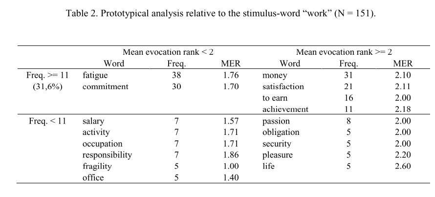

--- 
title: "Introducción a la ciencia de datos con R."
subtitle: "Una guía rápida para cientistas sociales."
author: "Gastón Becerra y Juan Pablo López Alurralde"
date: "`r Sys.Date()`"
site: bookdown::bookdown_site
output: 
  bookdown::gitbook
documentclass: book
bibliography: [book.bib, packages.bib]
biblio-style: apalike
link-citations: yes
github-repo: rstudio/bookdown-demo
description: "Curso de R"
---

# Introducción {-}

## Objetivos {-}

Estos recursos corresponden a un curso que busca introducir a estudiantes de sociología y psicología, y otras disciplinas de las ciencias sociales y las humanidades, a un análisis del big data como un fenómeno tecnológico, social y cultural, con una visión ética, epistemológica y crítica. Específicamente, aquí buscamos introducirnos al análisis de datos por medio del lenguaje R. Si bien este objetivo es explícitamente de nivel introductorio, creemos que puede ser un primer paso hacia un fin necesario: acercarnos al fenómeno de los datos, con una mirada *desde adentro*.

Escenarios sociales y técnicos como el big data, así como los avances en inteligencia artificial y la proliferación de algoritmos en diversas esferas de la vida social, entre otros fenómenos, están transformando la realidad social. Los y las científicas sociales no podemos ser ajenos a estas transformaciones. Debemos involucrarnos y trabajar junto a ingenieros, programadores, estadísticos, y otros profesionales, para que la mirada crítica y reflexiva que hemos desarrollado en nuestra formación profesional pueda ser incorporada. Y también para repensar y reevaluar nuestra propias maneras de hacer ciencia, y así actualizar y revitalizar aquello que hace únicas a las disciplinas sociales y humanísticas.

## Contenidos {-}

El libro consta (por ahora) de 4 tutoriales. Los primeros 2 introducen a la programacion con R desde cero, y a lo básico del procesamiento del lenguaje natural; los últimos 2 introducen a 2 métodos de aprendizaje automático (*machine learning*), que nos permitirán ver *en chiquitito* implementaciones de los problemas que discutiremos teóricamente.

Los materiales y casos prácticos se basan en fragmentos de nuestras propias investigaciones acerca del sentido social del big data [@Becerra2018]. Hemos optado por esta referencia a nuestros propios trabajos por dos razones: primero, porque nos va a permitir seguir en tema discutiendo acerca del big data; segundo, porque buscamos *abrir la cocina de la investigación* y tener la chance de discutir cómo las técnicas y los análisis que aquí presentamos pueden ser integrados en una investigación social.

### Tutorial #1. Explorar, manipular y visualizar datos {-}

En este tutorial aprenderemos *análisis exploratorio, manipulación de datos y construcción de gráficos*, para luego *construir nuestras propias funciones*. Esto nos permitirá *codear* los análisis necesarios para responder a la pregunta por los sentidos que se evocan al pensar en big data. 
Teórica y metodológicamente, aquí nos guiamos por el "análisis prototípico" del enfoque estructural de la Teoría de las representaciones sociales de @Abric2001. 
Trabajaremos con un dataset construido a partir de una encuesta que incluía la técnica de asociación de palabras con respecto a "big data", entre otros términos [@Becerra2020].

### Tutorial #2. Preprocesar texto y cruzar tablas {-}

En este tutorial aprenderemos lo básico de *preprocesamiento de texto* para empezar a analizar el lenguaje natural, y a *cruzar tablas* para realizar un *análisis de sentimientos* con diccionarios (lexicones). 
Estas tareas nos permitirán empezar a explorar la polaridad que recubre al sentido social del big data, y que oscila entre una “gran oportunidad” en torno al conocimiento, y un "gran riesgo" por su explotación para el control y el condicionamiento de los grupos sociales.

### Tutorial #3. Entrenamiento no-supervisado: modelado de tópicos {-}

En este tutorial veremos una técnica de entrenamiento no supervisado, denominada *topic modeling* (o modelado de tópicos), que nos permitirá explorar un dataset de noticias digitales que incluyen el término "big data" [@Becerra2019], buscando generar "temas" a partir de la distribución de palabras de los textos. Nuestro objetivo es explorar posibles *framings* en la construcción mediática del big data. En vista de este objetivo, esta técnica debe articularse con análisis interpretativo manual por parte del investigador. Esto nos permitirá discutir de qué manera las decisiones técnicas que introducimos en nuestros códigos responden a los desafíos de diseños cualitativos [@Auerbach2003]. 

### Tutorial #4. Entrenamiento supervisado: Clasificación {-}

En este tutorial veremos cómo *entrenar un modelo para clasificar texto*, particularmente, oraciones acerca del big data en positivas / negativas, a partir de otras oraciones ya clasificadas por humanos. Esta tarea retoma la pregunta planteada en el tutorial #2 por la polaridad del big data.

## Otros recursos {-}

Recomendamos (¡y mucho!) los siguientes recursos introductorios a la ciencia de datos y la programación en R, de licencia abierta, en castellano, y mayormente pensados para estudiantes de ciencias sociales:

- [Ciencia de Datos para Gente Sociable
](https://bitsandbricks.github.io/ciencia_de_datos_gente_sociable/) de Antonio Vazquez Brust (¡Excelente!)
- [AnalizaR Datos Políticos](https://arcruz0.github.io/libroadp/index.html) de Francisco Urdinez y Andrés Cruz Labrín (Editores)
- [RStudio para Estadística Descriptiva en Ciencias Sociales
](https://bookdown.org/gboccardo/manual-ED-UCH/) de Giorgio Boccardo Bosoni y Felipe Ruiz Bruzzone
- [R for Data Science (Español)](https://es.r4ds.hadley.nz/) Versión español del libro de Hadley Wickham y Garrett Grolemund.

Además, te invitamos a que busques las comunidades de usuarios y usuarias de R mas cercanos a vos en el siguiente [mapa de Meetup](https://www.meetup.com/es/pro/r-user-groups/).

<!--chapter:end:index.Rmd-->

# Entorno {-}

## Instalación de Lenguaje R  {-}

R es un lenguaje de programación pensado para computación estadística, que se distribuye de forma libre y gratuita bajo licencia GNU, y que corre en distintas plataformas y sistemas operativos. 

Para correr R es necesario instalar el **entorno que ejecuta el lenguaje**. 
Para ello tenés que descargar la última versión desde alguna copia regional (o *mirror*) del [CRAN: El archivo oficial de R](https://cran.r-project.org/mirrors.html) como, por ejemplo, la que aloja la [Universidad Nacional de La Plata](http://mirror.fcaglp.unlp.edu.ar/CRAN/), en Argentina.

<!-- ```{block, type='rmdcomment'} -->
> ¿No estás acostumbrado a instalar programas y preferís ver el proceso antes de meter mano? [Video: Cómo Descargar e Instalar R y RStudio - 2020](https://www.youtube.com/watch?v=D9Bp11iZssc)

## Instalación de Interface RStudio  {-}

Una vez que hayas descargado e instalado R, ya estarías en condiciones de introducir comandos en lenguaje R a través de la *consola*. No obstante, esto es muy rudimentario. 
Para trabajar generalmente se utiliza un programa adicional, un entorno gráfico (o *IDE*) que facilita varias cosas, como la edición de código con coloreado y ayuda para autocompletado, organizar fácilmente los archivos, visualizar objetos en memoria, recurrir a la ayuda, etc. El entorno más usado es [RStudio, cuya versión de escritorio se puede descargar gratuitamente](https://rstudio.com/products/rstudio/download/#download). 
Otra opción es usar el popular [Visual Studio Code con un plugin](https://marketplace.visualstudio.com/items?itemName=Ikuyadeu.r).

## Notebooks y Markdown {-}

Otra forma de ejecutar R es a través de *Notebooks*, documentos mixtos que mezclan bloques o *chunks* de código y texto. Las notebooks pueden ser muy cómodas para escribir informes (¡incluso algunos más complejos como este libro!) y para ejecutar código registrando tus comentarios, ya que podés ejecutar un bloque y ver el resultado debajo. 
Sin embargo, carecen de algunas funciones que tienen los IDEs como RStudio que pueden ser muy útiles cuando estás aprendiendo, como por ejemplo, una lista de objetos en memoria con visores integrados (por ejemplo, para ver una tabla).

Si tenés una cuenta de Google, podés correr R en las notebooks que te proporciona [Google Colab](https://colab.research.google.com/). Para predeterminar que el tipo de entorno de ejecución sea R (y no Python) podés entrar por este link: [https://colab.fan/r](https://colab.fan/r). Considerá que el soporte de Python está mucho más extendido, permitiendote interactuar con archivos de tu drive, entre otras cosas que con R no son tan simples.

Los notebooks permiten el uso de *Markdown*, un lenguaje de marcado (o más simplemente: una convención de escritura) que permite introducir formato usando símbolos. Por ejemplo, para poner una palabra en **negrita** simplemente se la envuelve en 2 asteriscos de cada lado; para ponerla en *cursiva/itálica*, se la envuelve en 1 asterisco de cada lado; para mostrar `código`, se utilizan *backtics* (`). Acá hay una [viñeta con las marcas más comunes](https://www.rstudio.com/wp-content/uploads/2015/02/rmarkdown-cheatsheet.pdf). RStudio soporta markdown y permite exportar el documento en distintos formatos, como HTML, pdf, slides, etc. Generalmente también podés incluir HTML.

<!-- ```{block, type='rmdcomment'} -->
> ¿Te estás mareando y preferís una explicación en video? [Video: Diferencias entre RStudio, R Markdown y R Notebook - 2020](https://www.youtube.com/watch?v=y7JPGlw6dJg)

<!--chapter:end:02-entornos.Rmd-->

# Análisis de datos con R

En este capítulos nos introduciremos al ciclo de trabajo del análisis de datos, así como al lenguaje R. Particularmente, vamos a aprender a:

1. cargar datos y recursos;
2. explorar y familiarizarnos con los datos y su estructura;
3. transformar los datos para limpiarlos y que tengan la estructura óptima para nuestros análisis;
4. hacer nuestros primeros gráficos;
5. generar nuestras propias funciones.

Trabajaremos con un dataset de asociaciones libres a la palabra "Big data". Este es un dataset construido a partir de una breve encuesta con la siguiente consigna: *Por favor, indicanos qué palabras o frases te vienen a la mente cuando pensás en "big data". También te pedimos que, por favor, nos indiques si estas ideas que acabas de introducir se corresponden con algo que valoras positivamente (algo que te agrada) o negativamente (algo que te desagrada)"*. Además, hemos registrado el orden en que cada palabra fue introducida por el participante (un valor generalmente entre 1 a 5, aunque los participantes podían ingresar más palabras).

Con este dataset, y a través de las tareas señaladas, vamos a intentar responder **cuál es el sentido común en torno al big data**. Esto nos ubica en las coordenadas de la psicología social, particularmente de la *teoría de la representación social*, a la que nos acercaremos siguiendo la variante estructural de @Abric2001, y recurriendo a técnicas cuantitativas. Hacia el final del capítulo recrearemos el "análisis prototípico" de esta teoría y discutiremos la interpretación de los resultados.

## Cargar datos y recursos

Lo primero que haremos es cargar algunas librerias (`package`) que van a poner a nuestra disposición un conjunto de funciones que utilizaremos a lo largo de todo el ejercicio. Recordá que una función es una secuencia de comandos que se aplican a un objeto que se le pasa a la función, referenciándolo entre sus paréntesis. Por ejemplo, utilizaremos la función `library()` y el nombre de las librerías para habilitar las funciones de `readr` para importar datos, y el conjunto de librerías del `tidyverse` para manipular y visualizar. 

Luego importaremos los datos con la función `read_csv()` de la librería `readr`. En RStudio podés listar a las funciones de un paquete si tipeas su nombre seguido de "::". Esta forma de vincular paquetes y funciones es recomendada, en tanto los nombres de las funciones pueden pisarse, dependiendo del orden en que cargamos los paquetes.

Nos interesa que esos datos importados se guarden como un objeto en memoria, ya que estaremos trabajando con ellos en lo que sigue. Para ello, utilizamos un operador de asignación ` <- `, precedido del nombre que le daremos al objeto (en nuestro caso `asociaciones`).

<!-- 2do: definir fuente de datos -->

```{r echo=TRUE, message=FALSE, warning=FALSE}
# para cargar una libreria primero hay que instalarla:
# install.packages("readr")
# install.packages("tidyverse")

library(readr) # vamos a cargar las librerias
library(tidyverse) 

asociaciones <- readr::read_csv(file = "https://raw.githubusercontent.com/gastonbecerra/curso-intro-r/main/data/asociaciones.csv")
```

## Explorar los datos

El objetivo del momento de exploración de los datos es familiarizarnos con la estructura de los datos, y transformarlos para poder realizar nuestros análisis. Por lo general, aquí se empiezan a decidir las tareas de *limpieza*. 

Lo primero que vamos a hacer es ver el tamaño de la tabla con `dim()`, y los primeros registros con `head()`. 

Esto nos va a permitir saber:

* la cantidad de registros y columnas;
* los nombres de las columnas y su tipo de dato;
* el contenido de los primeros registros.

```{r}
dim(asociaciones)
head(asociaciones, n = 10) 
```

Por lo que podemos ver, tenemos 4 columas: `id` y `palabra` son variables de texto (`<chr>`), mientras `orden` y `valoracion` son numéricas. Otro posible tipo de columna es el `factor` (`<fct>`) que sirve para registrar categorías, donde cada valor posible es un `level`.

Podemos ver que el valor de `id` se repite entre filas, lo que nos da la pauta que varios registros corresponden naturalmente juntos. En este caso, se tratan de las distintas palabras mencionadas por un mismo participante frente a "big data". Este diseño de tabla donde hay `n registros x 1 participante`, a diferencia de tener sólo registro con muchas columnas tiene muchas ventajas. Por el momento señalemos sólo 1: todas nuestras palabras quedan en la misma columna, de modo que si queremos procesarlas será muy fácil referenciarlas. Cada palabra propuesta tiene, además, el orden de evocación (`orden`) y la valoración dada (`valoracion`).

Luego, es útil tener una idea de los valores posibles de las distintas columnas o variables. `summary` nos devuelve un resumen de estadísticas descriptivas, que nos permite saber, por ejemplo, en qué rango se registran las valoraciones, o cómo se distribuyen los ordenes de evocación.

```{r message=TRUE, warning=FALSE}
summary(asociaciones)
```

Otras tareas que nos pueden interesar en el análisis exploratorios son:

* ver la cantidad de datos vacíos
* ver la cantidad de datos redundantes
* ver relaciones entre variables
* graficar el rango de valores de una o más variables

Muchas de estas tareas se pueden hacer con [distintos packages](https://www.groundai.com/project/the-landscape-of-r-packages-for-automated-exploratory-data-analysis/1).

Recordá que podes ver la tabla, como si estuvieras viendo una planilla, con `view(asociaciones)`.

## Transformar, visualizar y limpiar

Ahora vamos a ver de qué manera podemos transformar los datos para obtener respuestas a las siguientes preguntas:

1. ¿cuáles son las palabras más frecuentes?
2. ¿cuáles son las palabras con valoraciones más extremas?
3. ¿cuáles son las palabras que se evocaron más rápido?

Para responder esto vamos a utilizar verbos de manipulación (de `dplyr`, una librería incluida en `tidyverse') sobre nuestra tabla. Algunos de estos verbos son:

* `filter()` para filtrar los registos/observaciones por alguna condición de sus valores;
* `mutate()` para agregar una columna/variable con el resultado de alguna operación sobre otras columnas;
* `group_by()` y `summarise()` para realizar alguna operación sobre los datos de distintos registros, *reduciendolos* en uno sólo por grupos;
* `n()` que nos devuelve el conjunto de registros de un grupo (y que por ello se hace luego de `group_by()`); algo que podemos simplificar con `count()`;
* `arrange()` ordena los datos ascendente o descendentemente;

Luego, para encadenar estas acciones vamos a utlizar un operador denominado *pipe* (`%>%`) que funciona como un *tubo*: toma el objeto a su izquierda y lo hace pasar por la función a su derecha, devolviendonos el resultado. 
Esto nos permite una manera más fácil de pensar a la hora de escribir el código para manipular un objeto, que su alternativa de incluir al objeto entre los paréntesis de una función, ya que en primer lugar lo mencionamos y luego iremos paso a paso introduciendole transformaciones.

Antes que nada, empecemos por *chusmear* (`glimpse`) la estructura de la base para recordar las columnas/variables con las que podemos trabajar. Los nombres de las columnas aparecen precedidos con un `$`, una debajo de la otra, para que sea más facil de observar tablas largas. Luego, nos informa el tipo de variable y nos permite ver los primeros valores (que en entran en pantalla)

Nuestra tabla tiene las palabras que los participantes respondieron en la columna `asociaciones$palabra`, el orden en que dichas palabras fueron ingresadas por el participante en `asociaciones$orden`, y una valoración sobre esa palabra expresada en forma númerica en `asociaciones$valoracion`. 

Tenemos todos los elementos para responder las preguntas. Sólo falta diseñar un camino de operaciones para visibilizar la respuesta:

(Paso1) vamos a tomar la tabla que nos interesa `asociaciones`, y la vamos a pasar, para...
(Paso2) ...armar grupos de registros que compartan el valor en `asociaciones$palabra`, y para cada cual vamos a:
(Paso3) contar la cantidad de registros (dandonos la frecuencia con que dicha palabra fue asociada a big data);
(Paso4) y calcular la media de las valoraciones en `asociaciones$valoracion`,
(Paso5) así como la media del orden en que fue evocado (`asociaciones$orden`)
(Paso0) ... el resultado de esta operación la vamos a guardar en una tabla nueva, que luego operaremos para responder nuestras 2 preguntas. En tanto esta tabla *describe* la información de la anterior, notaremos que tiene muchos menos registros.

Para estas operaciones vamos a usar los comandos recién vistos:

```{r message=TRUE, warning=FALSE}
glimpse(asociaciones) # muestra la estructura de la tabla 

asoc_frecuentes <- asociaciones %>% # (Paso0) y (Paso1)
  group_by(palabra) %>% # (Paso2)
  summarize( 
    freq = n(), # (Paso3)
    valoracion_media = mean(valoracion), # (Paso4)
    orden_media = mean(orden) #(Paso5)
  )

glimpse(asoc_frecuentes) 
```

Más sintéticamente podríamos usar `tally()` o `count()`. Recordá que podés obtener ayuda sobre estos comando ejecutando `?tally()`.

Si ordenamos esta tabla ya estamos en condiciones de indicar cuáles son las palabras más/menos frecuentes. 
Para esto vamos a usar `slice_max()`, que ordena los datos y los corta en alguna posición.

```{r message=TRUE, warning=FALSE}
asoc_frecuentes %>%  # no guardamos el resultado, solo lo imprimimos
  slice_max(order_by = freq, n=10) # ordenamos por freq y cortamos en 10 registros
```

La palabra más evocada fue "información", junto con un conjunto de otras palabras que podemos decir que remiten al manejo de los datos mediados por la tecnología, con diversos productos, como puede ser el análisis de información y la generación de conocimiento, o la manipulación y el control (las únicas palabras que tienen una valoración negativa).

Para conocer las palabras más/menos valoradas deberemos generar otros cortes.

```{r message=TRUE, warning=FALSE}
asoc_frecuentes %>%  
  slice_max(order_by = valoracion_media, n=10) # las de valor mas alto

asoc_frecuentes %>%  
  slice_min(order_by = valoracion_media, n=10) # las de valor mas bajo
```

Más allá de que se puede inferir ciertos temas en las palabras (especialmente las negativas), nos debemos preguntar si tiene sentido trabajar con ideas y expresiones idiosincráticas, introducidos por un sólo participante. A fin de cuentas, la pregunta que guía toda nuestra exploración es sobre lso sentidos *comunes* o *compartidos*.
Podemos entonces establecer un umbral o mínimo de repeticiones para que una palabra nos resulte relevante o informativa. 

Miremos entonces las frecuencias. Otra vez, diseñemos un camino de operaciones:

(Paso1) vamos a tomar la tabla que nos interesa `asoc_frecuentes`, y la vamos a pasar, para...
(Paso2) ...armar grupos de registros que compartan el valor en `asociaciones$freq`, y para cada cual vamos a:
(Paso3) contar la cantidad de registros (dandonos la cantidad de palabras que fueron dicha la misma cantidad de veces);
(Paso4) vamos a visualizarlo en un gráfico de puntos que cruce la frecuencia y la cantidad de palabras. 

Por su parte, el diseño del gráfico va a requerir 3 componentes (mínimos): que insertemos datos (en este caso, vamos a estar pasando la tabla hecha hasta el paso 3 con un pipe, de modo que no necesitamos declararla de nuevo), que mapeemos algunos de esos datos a propiedades visuales del gráfico (como por ejemplo, un cierta columna/variable para un eje del gráfico), y que elijamos un sistema de representación o "geometry" (puntos, barras, áreas, etc.)

```{r message=TRUE, warning=FALSE}
asoc_frecuentes %>% # Paso1
  group_by(freq) %>% # Paso2
  summarize(cant_palabras = n()) %>% # Paso3
  ggplot( # Paso 4: usamos la librería ggplot2 y la función ggplot
    aes(x=cant_palabras,y=freq) # mapeeamos los datos en los ejes x e y
    ) + # los componentes de ggplot se concatenan con +, ya que no son pasos secuenciales
  geom_point()
```

Por lo visto, tenemos una distribución que sigue la [ley de Zipf](https://es.wikipedia.org/wiki/Ley_de_Zipf): muy poca cantidad de palabras tienen valores que se repiten muchas veces (los sentidos más comúnes), y hay casi 700 palabras que se repiten 1 sola vez. En vistas de esto podemos quedarnos con las palabras que se repiten más de 1 vez, criterio que utilizaremos para establecer un filtro (`filter()`). En esta ocasión, por simpleza, vamos a "pisar" nuestra tabla de datos con un fragmento de ella misma.

```{r message=TRUE, warning=FALSE}
asoc_frecuentes <- asoc_frecuentes %>% # vamos a pisar la tabla con el resultado
  filter(freq > 1)

glimpse(asoc_frecuentes)
```

Con este nuevo dataset deberíamos repetir los análisis anteriores sobre las palabras mas/menos valoradas. Este es un escenario al que deberemos acostrumbrarnos: **el proceso de transformación-visualización-limpieza es iterativo**. En la medida en que nos familiaricemos más con nuestros datos, que aclaremos nuestras preguntas, y que decidamos y programemos los análisis, deberemos repetirnos varias veces. 

Por últimos, nos queda indagar cuáles son las palabras que más rápidamente fueron evocadas en la encuesta, es decir, las que tiene un orden de evocación más cercano a 1. Estas son las ideas que probablemente sean las más accesibles y memorables. Pero ahora en lugar de una lista, veamos un gráfico en el que podamos incluir otra información: la valoración media de la palabra.

<!-- 2do: dar vuelta este analisis: el grafico para valoraciones, y la tabla boluda para orden -->

```{r message=TRUE, warning=FALSE}
asoc_frecuentes %>% 
    slice_min(order_by = orden_media, n=10) %>% # las de valor mas bajo
  ggplot( # vamos a usar ggplot para graficar
    aes( # dentro de aes indicamos las variables a vincular con las partes del gráfico
      y = palabra,
      x = orden_media,
      fill = valoracion_media
    )
  ) + 
  geom_col()
```

Estos primeros análisis ya nos dan una idea de la estructura de los datos, y algunas pistas sobre las respuestas. En lo que sigue vamos a poner todas estas operaciones juntas, con algunos pasitos extras, para poder hacer un *análiasis prototípico* según la *teoría de la representación social*.

## Funciones

En este apartado vamos a juntar estas operaciones de modo tal que nos permita realizar un *análiasis prototípico*, siguiendo el modelo estructural de @Abric2001 para la *teoría de la representación social*. Esta teoría supone que las representaciones se compone, por un lado, de un núcleo central que aúna los sentidos más comunes y estables de la representación, y por el otro, de elementos periféricos que concretizan la representación y la vinculan a los distintos contextos específicos de su uso. 

**¿Cómo se calcula?** Este análisis consiste en dividir las palabras evocadas en 4 -o más- segmentos, según su frecuencia y rango de evocación, y utilizando alguna medida estadística de estos valores como criterio de corte. Esto nos dejará un cuadro que cruza las palabras mas y menos frecuentes, y las evocadas más y menos rápidamente. Estos 4 segmentos suelen ser interpretados como el núcleo de la representación, sus elementos periféricos y dinámicos, y sus manifestaciones singulares e idiosincráticas. Sin embargo, vale la aclaración de @Wachelke2011: 

> In a strict sense, prototypical analysis is a convention for the presentation of data, not a standard statistical analysis. It is not a procedure that involves the calculation of parameters and significance levels, but a pattern for the organization of information relative to the evocation of verbal forms in a summarized way. 

Una decisión importante para este análisis es el criterio para establecer los cortes entre segmentos, aspecto que no tiene consensos en la literatura [@Dany2014]: algunos usan la media, otros la mediana, y otros alguna función pensada para una distribución como la de ley de Zipf. Otra decisión importante es la de utilizar algún umbral o mínimo de frecuencia para achicar el corpus. 

Aquí vamos a "empaquetar" las operaciones necesarias para el análisis en una función, con una serie de parámetros (inputs) y un valor de salida (output). Esto nos va a permitir fácilmente probar distintos parametros para las decisiones que debemos tomar, sin tener que volver a escribir el código de las operaciones. 

Para crear una funcion vamos a utilizar `function()` incluyendo los parametros que esperamos entre los paréntesis. Vamos a guardar la función en un objeto (y así le vamos a dar un nombre que podamos invocar después) con `<-`.

```{r}
analisis_proto <- function (tabla_evocaciones) {
  
  # las operaciones van aca...
  # por ahora no vamos a hacer nada mas que asignar nuestro input a un nuevo objeto...
  objeto_a_devolver <- tabla_evocaciones 
  
  return(objeto_a_devolver) # ... y lo devolvemos
}
```

Podemos llamar a la función con `analisis_proto(asociaciones)`. Dada las operaciones que le definimos dentro, no nos debe sorprender que la función no haga más que llamar al objeto. 

```{r}
analisis_proto(asociaciones) 
```

Es importante notar una cosa. Si prestamos atención al entorno, vamos a ver que el `objeto_a_devolver` no aparece en nuestra lista de objetos. Esto es porque quedó "encapsulado" en la función, y no está disponible por fuera de ella. Lo mismo puede decirse de `tabla_evocaciones`, que es la forma en que en la función llamamos a nuestro primer parámetro (los datos).

Aclarada la estructura y el uso de una función, ya sólo resta pensar en cuáles son los pasos a seguir para realizar el *análiasis prototípico*. Para eso, volvamos a la definición más arriba, y pensemos la secuencia de operaciones que necesitamos:

(paso 1) primero debemos calcular las frecuencias de cada palabra y sus medias de valoracion y orden; 
(paso 2) deberemos definir una frecuencia mínima;
(paso 3) vamos a calcular los criterios de corte para distinguir los mas/menos frecuentes y los evocados mas/menos rápidamente;
(paso 4) vamos a utilizar estos criterios de corte para segmentar las asociaciones, indicando qué palabras corresponden a qué segmento;

Como la idea es poder probar distintos criterios y decisiones, algunos de estos pasos suponen que podamos introducir algún parámetro: 
(paso 2) vamos a introducir una frecuencia mínima;
(paso 3) vamos a indicar si queremos usar la media o la mediana para calcular el criterio de corte, es decir si aplicamos `mean()` o `median()`, esta operación condicional la haremos con una estructura de control: `if( criterio ) { ... } else { ... }`.
Estos 2 parámetros los vamos a incluir en la función, con un valor por defecto: `2` para la frecuencia mínima, y `media` para calcular el criterio.
Vamos a utilizar el comando `message()` para que al correr la función se muestren estos parámetros, y también para observar la cantidad de palabras que quedan en cada segmento, dados estos parametros (paso 5).

```{r}
analisis_proto <- function (tabla_evocaciones, frecuencia_minima = 2,  criterio_corte = "media") {
  
  # (paso 1) tabla de frecuencias
  asoc_frecuentes <- asociaciones %>% 
    group_by(palabra) %>% 
    summarize( 
      freq = n(), 
      valoracion_media = mean(valoracion), 
      orden_media = mean(orden) 
    )  
  
  # (paso 2) establecemos un umbral de frecuencia minima (usando parametro)
  asoc_frecuentes <- asoc_frecuentes %>% 
    filter(freq > frecuencia_minima) 
  message("frecuencia minima = ", frecuencia_minima)
    
  # (paso 3) calculamos el corte de frecuencia (usamos mean o median, segun parametro)
  if (criterio_corte == "media") {
    freq_cut <- mean(asoc_frecuentes$freq) 
    orden_cut <- mean(asoc_frecuentes$orden_media) 
  } else {
    freq_cut <- median(asoc_frecuentes$freq) 
    orden_cut <- median(asoc_frecuentes$orden_media) 
  }
  message("valor corte frecuencia = ", freq_cut)
  message("valor corte orden = ", orden_cut)
  
  # (paso 4) segmentamos las palabras
  prototipico <- asoc_frecuentes %>% mutate( segmento = case_when(
    freq >= freq_cut & orden_media < orden_cut ~ 1,
    freq >= freq_cut & orden_media >= orden_cut ~ 2,
    freq < freq_cut & orden_media < orden_cut ~ 3,
    freq < freq_cut & orden_media >= orden_cut ~ 4 
  )
  ) %>% arrange(segmento, desc(freq,orden_media))
  
  # (paso 5) vamos a contar las palabras en cada segmento y lo mostramos en pantalla
  palabras_por_segmento <- prototipico %>% 
    count(segmento) %>%
    pull(n) # pull extrae una variable, quedando como vector
  message("palabras en cada segmento = ", 
          paste(palabras_por_segmento, collapse = " | "))
  
  # ... y lo devolvemos
  return(prototipico) 
}
```

Veamos el objeto que nos devuelve, por ahora con los valores por defecto:

```{r}
analisis_proto(tabla_evocaciones = asociaciones)
```

Ahora podemos probar otros parámetros: 

```{r}
analisis_proto(tabla_evocaciones = asociaciones, frecuencia_minima = 3, criterio_corte = "mediana")
```

Otra vez, es hora de tomar decisiones. Como vemos, esta última configuración logra quedarse con menos palabras, pero a la vez incrementa el tamaño del 1er segmento, que dado que es donde iremos a buscar los sentidos centrales, conviene que sea más pequeño. Podemos asumir que un umbral de frecuencia mínimas más alto, y una división por medias debería dar un conjnto más chico de palabras en el segmento 1, y menos palabras en total.

```{r}
analisis_proto(tabla_evocaciones = asociaciones, frecuencia_minima = 5, criterio_corte = "media")
```

Va tomando forma! 

## Interpretación

Siguiendo el *análisis prototípico*, nos interesan las asociaciones registradas con una frecuencia mayor y un rango por debajo de la media, es decir, las más frecuentes y salienten, ya que son las principales candidatas a expresar los sentidos más centrales y consensuados de la representación. En nuestra tabla serían aquellos registros con `segmento == 1`.

En @Becerra2020 con un dataset muy similar a este sugeríamos:

> El primer segmento comprende a las palabras enunciadas más frecuentemente y de más rápida evocación, es decir, las más comunes y accesibles. Estos son los términos que se puede decir que constituyen el núcleo de la representación: información, dato, internet, control, grande, bases de datos, manipulación, conocimiento, marketing, poder, computadora, espionaje, y grandes datos. Mayormente refieren a lo que denominamos la “premisa” del big data: la disponibilidad de grandes bases de datos, plausibles de otorgar información. Es interesante señalar que el término grande (lemma en el que convergen distintos términos, tales como grandes, mucho) es el único en el núcleo que remite a las famosas 3 V’s –volumen, velocidad y variedad– que popularizara Laney y que se referencia en prácticamente todas las noticias que buscan introducir al big data a un público masivo ...

> Mayormente estos términos están asociados con una valoración positiva, ... siendo conocimiento la palabra de mayor valor medio ... Sin embargo, también aparecen en este mismo segmento, las 3 palabras de menor valoración en todo el corpus: manipulación, espionaje y control. ... La distribución de estas valoraciones es indicativa de la polaridad que recubre el campo semántico del big data, en tanto la imagen de la “gran oportunidad” que ofrece su promesa epistémica, convive con una retórica de sospecha frente a los riesgos de su explotación para el sometimiento y el condicionamiento de otros, como un “gran hermano”.

Veamos una tabla típica con las que se suelen mostrar estos análisis prototípicos. El sigiuente es un ejemplo tomado de @Wachelke2011, sobre un estudio de las RS sobre el trabajo.



El cuadro está compuesto por 4 cuadrantes, resultante de ordenar las palabras por frecuencia y orden de evocación, ambas cortadas en 2 segmentos por el punto medio. La tabla es clara en segmentar palabras, aunque no hay manera fácil de identificar los segmentos si no es comparando frecuencias. Además, si quisierámos agregar una variable, como es valoración en nuestro caso, las tablas se vuelven extensas para compararlas. 

Un gráfico debería debería permitirnos visualizar esto mejor!

Vamos a dibujar un gráfico que:
* permita dibujar puntos en el cruce de frecuencia (X) y orden de evocación (Y),
* que incluya las palabras en el gráfico, de modo tal que podamos leerlas por grupitos,
* que señale con color la valoración,
* que muestre los puntos de corte en frecuencia (X) y orden de evocación (Y),
* y que remarque el cuadrante del núcleo central.

```{r}
prototipico <- analisis_proto(tabla_evocaciones = asociaciones, frecuencia_minima = 5, criterio_corte = "media")
glimpse(prototipico)

prototipico %>%
  ggplot(aes(x=freq,y=orden_media,label=palabra)) + # frecuencia x orden
  scale_x_continuous(trans='log') + # vamos a aplicar una transformación al eje X para ver mejor los puntos
  geom_hline(yintercept = 2.87623694419952, linetype = 2) + # tomamos este valor del mensaje de la función
  geom_vline(xintercept = 15.219512195122, linetype = 2) +  # tomamos este valor del mensaje de la función
  geom_point(aes(size=freq, colour=valoracion_media), show.legend = TRUE) + # agregamos los puntos
  scale_colour_gradient(low = "red", high = "green", na.value = NA) + # gama de colores para valores continuos
  geom_text( aes(size=20, colour=valoracion_media), fontface = "bold",
             show.legend = FALSE, nudge_y = -.1, check_overlap = TRUE) + # agregamos las palabras
  labs(y="Orden de evocación", x = "Frecuencia (log)") +
  theme_minimal()

```

<!--chapter:end:03-exploratorio.Rmd-->

# Procesamiento del lenguaje natural y Análisis de sentimiento

En este capítulo nos introduciremos al procesamiento del lenguaje natural, y a una tarea particular de dicho campo: el análisis de sentimiento o polaridad.

Particularmente, vamos a aprender a:

1. pre-procesar texto para su posterior análisis;
2. cruzar tablas (en nuestro caso, oraciones y diccionarios);
3. realizar un análisis de sentimiento, incluyendo la preparación de los datos para el uso de librerías específicas.

Trabajaremos con un corpus de oraciones, extraídas de noticias argentinas que incluyen la palabra "big data". El objetivo de nuestro análisis será **determinar si el big data es valorado como un fenómeno positivo o negativo**, de acuerdo a la carga valorativa de las palabras que le dan contexto. 
Esta tarea puede ser útil para comenzar a explorar el fenómeno de la polaridad del big data. Al respecto, luego de analizar noticias acerca de big data en diarios de Estados Unidos, Reino Unido y Australia, @Paganoni2019 sugiere: 

> Big data appears to be framed between two poles—data and information as opposed to rights and privacy—whose gap has of late been emphasised by a number of data scandals affecting business, health and politics, and culminating in the major unforeseen event of Cambridge Analytica and Facebook.

A lo largo de este tutorial trabajaremos con varias librerías, que podemos instalar con el siguiente código:

```{r eval=FALSE}
install.packages(c("readr", "tidyverse", "tidytext")) # las hemos instalado en capítulos anteriores
install.packages(c("udpipe")) # las usaremos por primera vez
```

    
## Pre-procesamiento de texto

Naturalmente, antes de todo proyecto de análisis de datos, necesitamos datos. El dataset con el que trabajaremos en este capítulo fue construido a través de la técnica de *scrapping*, que consiste en capturar datos a partir de la exploración de los elementos y anotaciones HTML de sitios webs. Ahora bien, si quisiéramos inmediatamente "procesar" estos datos, nos encontraríamos con varios problemas. Para empezar, ¿Cómo podríamos hacer para que el montón de textos que tenemos sea interpretable por una máquina que no habla ni entiende nuestro idioma? 

Pues bien, con cualquier dataset, digamos, mayormente numérico, el problema del procesamiento consta de realizar ciertas tareas casi estandarizadas: eliminar outliers, normalizar los datos, completar o desechar valores faltantes, etc. Así, si quisiéramos analizar datos relativos a departamentos en alquiler, por ejemplo, donde nos interesaría predecir el precio de nuevas unidades en función de características como la ubicación, superficie y antigüedad, deberíamos realizar esta serie de operaciones que describimos recientemente para asegurarnos de tener los mejores resultados posibles. Esto no aplica directamente en el terreno del lenguaje natural, donde las tareas de preprocesamiento serán distintas.

El preprocesamiento de datos extraídos del lenguaje natural apunta a la construcción de una representación matemática de los mismos que, como tal, sea entendible y computable por nuestras funciones y modelos. En particular, la representación “matemática” de la que aquí hablaremos será la de un vector, pero hablaremos de esto un poco más adelante. Por lo pronto, es importante entender que lo que se busca es “estructurar” los datos “no-estructurados” para volverlos computables. 

Para llegar a esta instancia de “estructuración” del lenguaje natural, el preprocesamiento deberá encargarse de una serie de operaciones sobre nuestro corpus de texto tendientes a su normalización. En este capítulo haremos 2 tareas específicas: (1) tokenización y análisis morfosintáctico, (2) reducción de las palabras del vocabulario.

Para ello empecemos por cargar los datos

```{r import_sentiment, echo=TRUE, message=FALSE, warning=FALSE}
library(readr) # para leer csv
library(tidyverse) # para manipular tablas

oraciones <- readr::read_csv(file = "https://raw.githubusercontent.com/gastonbecerra/curso-intro-r/main/data/oraciones_entrenamiento.csv") # importamos datos
glimpse(oraciones) # miramos la estructura de la base
```

Para el análisis morfosintáctico trabajaremos con la librería UdPipe, desarrollada por el [Instituto de linguistica formal y aplicada de la Universidad de la República Checa](https://ufal.mff.cuni.cz/udpipe), que tiene un modelo para procesar texto en castellano.

Lo primero que debemos hacer es instalar la librería. Luego, deberemos descargar el modelo del idioma que nos interesa. 

```{r, eval=F, echo=T}
install.packages("udpipe")
modelo_sp <- udpipe::udpipe_download_model('spanish') # descarga el modelo y guarda la referencia  
modelo_sp$file_model # refrencia al modelo descargado
```

O si ya lo tenemos descargado, es conveniente referenciarlo:

```{r, eval=T, echo=T}
library(udpipe)
modelo_sp <- udpipe_load_model(file = "../dix/spanish-gsd-ud-2.5-191206.udpipe")
```

Con el modelo ya estamos en condiciones de empezar a *parsear* nuestro corpus de oraciones, y *anotar* qué tipo de componente es cada palabra.

```{r eval=F, echo=T}
oraciones_anotadas <- udpipe_annotate( 
  object = modelo_sp, # el modelo de idioma
  x = oraciones$oracion, # el texto a anotar, 
  doc_id = oraciones$doc_id, # el id de cada oracion (el resultado tendrá 1 palabra x fila)
  trace = 100
  ) %>% as.data.frame(.) # convertimos el resultado en data frame
```

```{r message=FALSE, warning=FALSE, include=FALSE}
# guardamos el parseado
# glimpse(oraciones_anotadas)
# readr::write_csv(x = oraciones_anotadas, file = "data/oraciones_anotadas.csv")

# tomamos el parseado
oraciones_anotadas <- readr::read_csv(file = "data/oraciones_anotadas.csv")
```

Vamos a examinar la tabla con las oraciones parseadas:

```{r}
glimpse(oraciones_anotadas)
```

Esta anotación se ha encargado de muchas tareas típicas del pre-procesamiento de texto:

* *tokenización*: la unidad mínima del análisis es ahora cada palabra (notá que por eso hay muchas mas filas que antes). El `doc_id` nos permitirá volver a unir las piezas cuando hagamos tareas por oraciones; 
* para cada palabra se ha anotado el tipo en `upos`;
* se ha convertido la palabra a su raíz en `lemma`.

Podemos usar `upos` para filtrar palabras. Este paso es una alternativa a la eliminación de *stopwords* y palabras que no aportan contenido semántico de manera directa (por ejemplo, las preposiciones).

La *lemmatización* es un procedimiento que busca reducir las palabras a su forma no flexionada o conjugada. Es una alternativa a la *stemmization*, que intenta reducir heurística e iterativamente la extensión de las palabras, removiendo caracteres, hasta reducirlas a su raíz. Así, la expresión "Google analiza big data para inferir el ritmo de contagio de la gripe H1N1”, queda lemmatizada como "google analizar bigdata inferir ritmo contagio gripe h1n1".

```{r}
oraciones_anotadas2 <- oraciones_anotadas %>% 
  filter(upos=="ADJ"| upos=="VERB"| upos=="NOUN" | upos=="ADV") # filtramos por tipo de palabra
glimpse(oraciones_anotadas2)
```
Es interesante señalar que pasamos de `r nrow(oraciones_anotadas)` palabras parseadas y anotadas, a solo `r nrow(oraciones_anotadas2)`, que son con las que trabajaremos.

## Análisis de sentimiento

Generalmente se acepta que hay 2 métodos para este tipo de análisis: 

1. un enfoque basado en "lexicos" o "lexicones" (diccionarios que incluyen para cada palabra una valoración en alguna dimensión afectiva, como el agrado), y que consiste en calcular la valoración media del texto que nos interesa, a partir de pesar aquellas palabras que están en los lexicones;
2. un enfoque basado en clasificación / aprendizaje automático, que busca inferir reglas para establecer la polaridad de una oración a partir de estudiar un dataset de oraciones previamente clasificadas (por un humano). 

En este capítulos nos centraremos en el primer enfoque (lexicones), dejando el aprendizaje para un capítulo posterior. 
Buscaremos implementar esto de dos maneras: 

1. en primer lugar, cruzando la tabla de oraciones con el lexicon, y haciendo nosotros alguna evaluación; 
2. en segundo lugar, con una librería que contemple las falencias de nuestro primer enfoque.

### Cruce con lexicones

Ahora podemos cruzar los lemmas de nuestras oraciones con los lexicones, para calcular la orientación de cada oración que incluye big data.

Vamos a trabajar con 1 lexicón construido a partir de otros dos: 1. *Spanish Dictionary Affect Language* (`sdal`), desarrollado por @Gravano2014, que replica el modelo de @Whissell2009. Este es un lexicon formado por 2700+ términos, clasificados manualmente en tres dimensiones afectivas, de las cuales aquí utilizamos el agrado; 2. *Lexicon de evocaciones a big data* (`evoc`), desarrollado por @Becerra2020 en el marco de una investigación sobre las representaciones sociales del big data con la técnica de la evocación libre de palabras, a la que se añadió la posibilidad de aclarar la valoración del término incluído. Este es un lexicon formado por 1500+ términos. Para unir estos lexicones tuvimos que lemmatizar los términos, escalar las valoraciones dentro del rango -1 y 1, eliminamos ambigüedades calculando la media. 

```{r eval=FALSE, include=FALSE}
# mergeo los lexicones
evoc <- readr::read_csv("./data/lexicon2021.csv") %>%
  select(-X1, -f)%>%
  filter(!is.na(lemma)) %>% 
  filter(lemma!="bigdata") %>% mutate(v=((v/10)*2)-1) # llevar a -1|1
sdal <- readxl::read_excel("./data/sdal.xlsx") %>%
  mutate(lemma = str_extract(pattern = "[^_]+", string = palabra)) %>% 
  group_by(lemma) %>%
  summarise(v=mean(as.numeric(agrado))) %>% 
  mutate(v=((v/3)*2)-1) # llevar a -1|1
lexicones <- rbind(
    sdal %>% select(lemma,v) ,
    evoc %>% select(lemma,v) 
    ) %>% 
  group_by( lemma ) %>% summarise(v=mean(v))
rm(evoc,sdal)
readr::write_csv(lexicones, 'data/lexicones.csv')
```

```{r}
lexicones <- readr::read_csv('https://raw.githubusercontent.com/gastonbecerra/curso-intro-r/main/data/lexicones.csv')
summary(lexicones)
```
Ahora sí: vamos a cruzar tablas! Particularmente, nos interesa ver si los lemmas que extrajimos de nuestras oraciones coinciden con los lemmas en los lexicones. 
En cuyo caso, vamos a anotar la media de las valoraciones de estos lexicones, junto con la cantidad de lemmas que tomamos de cada oracion (para saber cuantos lemmas con valoraciones hay en la oracion), entre otros indicadores que podamos usar para evaluar y filtrar resultados.

Para cruzar tablas usaremos los verbos `_join`, o más específicamente, `left_join` que mantiene todas las filas de nuestra tabla, agregandole las columnas con los valores de otra. Para hacer el cruce de tablas, `_join` utiliza las columnas de nombre coincidente (aunque podés especificar los pares con `by = c("x"="y")`). Esta es una opción de unión entre otras: `left_join`, `inner_join`, `anti_join`.


```{r}
oraciones_lexicones <- oraciones_anotadas2 %>% 
  select(doc_id, lemma) %>% 
  mutate(doc_id=as.integer(doc_id)) %>%
  left_join(lexicones, by="lemma") %>% # cruzamos con el lexicon sobre los registros de nuestra tabla
  group_by(doc_id) %>% # ahora vamos a calcular valores por oración
  summarise(
    valor=mean(v, na.rm = TRUE), # valoración media
    cruzadas_n=length(v[!is.na(v)]), # cantidad de palabras con valoracion
    cruzadas_lemmas=paste(lemma[!is.na(v)], collapse = " ") # palabras con valoracion
  ) 

glimpse(oraciones_lexicones)
summary(oraciones_lexicones)
```

Exploremos un poco estos resultados. Busquemos oraciones con las valoraciones más altas y más bajas. 
Para poder comprender mejor lo que estamos evaluando, volvamos a incluir las oraciones, previas a nuestro preprocesamiento.

```{r message=FALSE}
oraciones_lexicones %>%
  slice_max(order_by = valor, n = 10) %>%
  inner_join(oraciones, by="doc_id") %>% # indicamos el par de columnas a usar para el cruce
  head(8)

oraciones_lexicones %>%
  slice_min(order_by = valor, n = 10) %>%
  inner_join(oraciones, by="doc_id") %>% # indicamos el par de columnas a usar para el cruce
  head(8)
```

Evaluemos los resultados y tomemos decisiones: ¿Nos resultan satisfactorios, considerando nuestros objetivos y el uso que daremos a estos datos posteriormente? ¿Queremos introducir reglas ad-hoc para mejorar estos resultados? ¿Cuántos casos se pierden por introducir reglas? ¿Cuán arbitrario se vuelve nuestro modelo?

Estamos otra vez en el momento iterativo de la exploración. Volvamos a probar introduciendo un mínimo de palabras con valoración por oración...

```{r message=FALSE}
oraciones_lexicones %>%
  filter(cruzadas_n>2) %>%
  slice_max(order_by = valor, n = 10) %>%
  inner_join(oraciones, by="doc_id") %>% # indicamos el par de columnas a usar para el cruce
  head(8)

oraciones_lexicones %>%
  filter(cruzadas_n>2) %>%
  slice_min(order_by = valor, n = 10) %>%
  inner_join(oraciones, by="doc_id") %>% # indicamos el par de columnas a usar para el cruce
  head(8)
```

Estos resultados parecen ser un poco mejores, aunque esta evaluación dependerá mucho del uso que querramos darle luego. Recordemos que el dato es un momento en un proceso...

Ahora que podemos intuir los límites y potenciales de este tipo de procesamiento del lenguaje, vamos a volver a realizar estos análisis, con un procedimiento mucho más robusto, utilizando funciones de librerías o packages. 

### Uso de packages

En lo que sigue vamos a realizar *sentiment analysis* utilizando packages, particularmente con `txt_sentiment` del package `Udpipe` que ya usamos para anotar las oraciones.

Los pasos generales cuando quieras trabajar con funciones de packages son:

1. consultar la documentación;
2. preprocesar los datos y transformar los objetos;
3. usar la función y evaluar los resultados;

Primero, vamos a consultar la documentación del package para conocer qué funciones podemos ejecturar. 
Un buen punto de entrada es consultar la vignette, generalmente una suerte de introducción rápida del pack. 

```{r eval=FALSE}
browseVignettes("udpipe")
```

Otra opción es ir directamente a la documentación de la función, en la que encontraremos una descripción de los parámetros y ejemplos:

```{r eval=FALSE}
?udpipe::txt_sentiment
```

Veamos qué debemos especificar en esta función:

<!-- 2do: probar constrain en esta funcion! -->

* `x` es el dataframe que devuelve el preprocesamiento con udpipe;
* `term` es el nombre de la columna (dentro de `x`) que contiene las oraciones a analizar;
* `polarity_terms` es un dataframe que contiene 2 columnas: términos (`terms`) y polaridad (`polarity`), que puede ser de 1 o -1.
* `polarity_negators` , `polarity_amplifiers`, `polarity_deamplifiers` son vectores de palabras que niegan, aumentan o reducen la orientación de las palabras (por ejemplo, si tenemos "bueno" en el lexicon con una valoración de 1, y "muy" dentro de los amplifiers, "muy bueno" podría suponer una valoración más alta que la dada por el lexicon, con un factor que se explicita en `amplifier_weight`). La ventana de palabras en las que se buscan estas palabras se configura con `n_before` y `n_after`.

Vamos a preparar los datos para cumplir estos parámetros:

```{r}
# preparamos el lexicon para que los términos tengan 2 valores: 1 positivas y -1 negativas
polarity_terms <- lexicones %>%
  mutate(polarity = if_else(v>0,1,-1)) %>%
  select(term=lemma, polarity)

# preparamos los términos que modifican pesos
polarity_negators <- c("no","nunca","nadie")
polarity_amplifiers <- c("muy", "mucho", "mas")
polarity_deamplifiers <- c("poco", "casi", "alguno", "menos")
```

Recordemos que tenemos las oraciones ya preprocesadas con `udpipe` en `oraciones_anotadas2`.

Todo listo! Corremos la función y vemos el objeto resultante.

```{r sentiment_analysis}
oraciones_txt_sentiment <- txt_sentiment(
  x = oraciones_anotadas2,
  term = "lemma",
  polarity_terms = polarity_terms,
  polarity_negators = polarity_negators,
  polarity_amplifiers = polarity_amplifiers,
  polarity_deamplifiers = polarity_deamplifiers)

glimpse(oraciones_txt_sentiment)
```

Este tipo de objetos son muy comunes en los objetos que devuelven las funciones y modelos. Se trata de una lista: un objeto que aloja otros objetos, como por ejemplo, un dataframe y un vector. Accedemos a estos elementos con el operador `$`.

En el caso del objeto devuelto por `txt_sentiment`, hay 2 objetos que podemos consultar

* `oraciones_txt_sentiment$data` que tiene la tabla resultante del cruce de las oraciones anotadas (recordemos: 1 fila x lemma) con los diccionarios y modificadores, dando un valor final `oraciones_txt_sentiment$data$sentiment_polarity`;
* `oraciones_txt_sentiment$overall` que tiene la tabla con los valores a nivel oración, incluyendo la polaridad en `oraciones_txt_sentiment$overall$sentiment_polarity`;

Veamos este último objeto, para evaluar los resultados:

```{r}
oraciones_txt_sentiment$overall %>% 
  slice_max(order_by = sentiment_polarity, n=10) %>%
  left_join(oraciones, by="doc_id")

oraciones_txt_sentiment$overall %>% 
  slice_min(order_by = sentiment_polarity, n=10) %>%
  left_join(oraciones, by="doc_id")
```

`txt_sentiment` suma los scores de las palabras por oración, lo que hace esperable que las oraciones más largas muestren una polaridad más extrema. Por ello tal vez convenga normalizar este score por la cantidad de palabras en cada oración:

```{r}
oraciones_txt_sentiment$overall %>% 
  mutate(sentiment_polarity2=sentiment_polarity/terms) %>%
  slice_max(order_by = sentiment_polarity2, n=10) %>%
  left_join(oraciones, by="doc_id") %>%
  select(sentiment_polarity2,oracion)

oraciones_txt_sentiment$overall %>% 
  mutate(sentiment_polarity2=sentiment_polarity/terms) %>%
  slice_min(order_by = sentiment_polarity2, n=10) %>%
  left_join(oraciones, by="doc_id") %>%
  select(sentiment_polarity2,oracion)
```

Tiene bastante sentido, no?


<!--chapter:end:04-sentiment.Rmd-->

# Modelado de tópicos

En este capítulo nos introduciremos a una técnica de aprendizaje no supervisado en el campo del procesamiento del lenguaje natural: el modelado de tópicos (*topic modeling*). Esta técnica busca construir tópicos o temas en base a las distribuciones de palabras en un conjunto de documentos.

A lo largo de este ejercicio veremos:

1. cómo pre-procesar texto para su posterior análisis;
2. cómo construir vectores de documentos por términos;
3. cómo modelar tópicos;
4. cómo interpretar los tópicos, leyendo los resultados junto con nuestro propio análisis cualitativo, entre otras indagaciones.

Vamos a utilizar esta técnica para intentar explorar **¿Cuál es la tematización del big data en la prensa?**, utilizando un corpus de noticias que incluyen la palabra "big data", tomadas de periódicos digitales argentinos. Nos interesa particularmente indagar de qué manera el big data es contextualizado, de modo tal que el modelado de tópicos pueden asistir al análisis de "frames" discursivos. Este tipo de análisis son útiles para investigar acerca de la construcción social de un fenómeno por parte de un sistema de comunicación, como es la prensa [@Jacobi2016].

A lo largo de este tutorial trabajaremos con varias librerías, que podemos instalar con el siguiente código:

```{r eval=FALSE}
install.packages(c("readr", "tidyverse", "tidytext", "udpipe")) # las hemos instalado en capítulos anteriores
install.packages(c("topicmodels", "stopwords", )) # las usaremos por primera vez
```


## Pre-procesamiento de texto

Como en toda tarea de procesamiento del lenguaje natural, comenzaremos por cargar el corpus y preprocesar el texto.

```{r eval=FALSE, include=FALSE}
noticias_para_anotar <- readRDS("./data_ignore/noticiasLimpias_2026_20191018_130620.rda")
glimpse(noticias_para_anotar)

# elegir 5 fuentes y cortar 20 de cada uno
noticias_para_anotar <- readRDS("./data_ignore/noticiasLimpias_2026_20191018_130620.rda") %>%
  select(id=noticia_id, fecha, titulo=items.title, txt=text, fuente=items.displayLink ) %>% 
  distinct(titulo, .keep_all = TRUE) %>%
  filter(fuente %in% 
           c("www.clarin.com", "www.infobae.com", "www.pagina12.com.ar", "www.lanacion.com.ar"),
         !is.na(txt),
         !is.na(fecha)
  ) %>%
  group_by(fuente) %>% sample_n(25) %>%
  ungroup() 

glimpse(noticias_para_anotar)
table(noticias_para_anotar$fuente)

noticias_para_anotar %>% saveRDS(file = "data/noticias_curso.rds")
```

```{r echo=TRUE, message=FALSE, warning=FALSE}
library(tidyverse) # para manipular en general
library(tidytext) # para convertir los objetos a formatos requeridos / devueltos por LDA

noticias <- readRDS(file = "https://raw.githubusercontent.com/gastonbecerra/curso-intro-r/main/data/noticias_curso.rds") %>%
  mutate(id=1:n())
glimpse(noticias) # miramos la estructura de la base
```

Para poder completar nuestros análisis primeros realizaremos varias tareas de preprocesamiento:

1. Haremos un análisis morfosintático para determinar los distintos componentes de la oración;
2. Reduciremos las palabras a sus *lemmas*, formas básicas de las palabras, sin género ni conjugación;
3. Descartaremos algunas palabras comunes, quedándonos sólo con las más significativas.

Para estas tareas trabajaremos con la librería UdPipe, desarrollada por el [Instituto de linguistica formal y aplicada de la Universidad de la República Checa](https://ufal.mff.cuni.cz/udpipe), que tiene un modelo para procesar texto en castellano. En el capítulo anterior hemos instalado esta librería y descargado el modelo del idioma.

```{r, eval=T, echo=T}
library(udpipe)
modelo_sp <- udpipe_load_model(file = "../dix/spanish-gsd-ud-2.5-191206.udpipe") # ruta al modelo
```

```{r eval=F, echo=T}
noticias_anotadas <- udpipe_annotate( 
  object = modelo_sp, # el modelo de idioma
  x = noticias$txt, # el texto a anotar, 
  doc_id = noticias$id, # el id de cada oracion (el resultado tendrá 1 palabra x fila)
  trace = 20
  ) %>% as.data.frame(.) # convertimos el resultado en data frame
```

```{r message=FALSE, warning=FALSE, include=FALSE}
# guardamos el parseado
# readr::write_csv(x = noticias_anotadas, path = "data_ignore/noticias_anotadas.csv")

# tomamos el parseado
noticias_anotadas <- readr::read_csv(file = "data_ignore/noticias_anotadas.csv")
```

Al igual que en el capítulo anterior, usaremos la información de `upos` para filtrar las palabras que podrían ser más signficativas: adjetivos, verbos, y sustantivos. 
Aquí omitimos los adverbios, ya que no nos interesan las posibles modificaciones del sentido entre palabras cercanas, como negaciones o amplificaciones.
Además introduciremos otro filtro: eliminaremos palabras muy comunes en el lenguaje, que dificilmente puedan ayudarnos a identificar un campo semántico. Para eso recurrimos a un diccionario de palabras comunes, del pack `stopwords`, y eliminaremos esos registros con `filter`. Además, incluimos un conjunto de verbos ad-hoc para ser eliminados.

```{r message=FALSE, warning=FALSE}
library(stopwords)
noticias_anotadas2 <- noticias_anotadas %>% 
  filter(upos=="ADJ"| upos=="VERB"| upos=="NOUN") %>% # filtramos por tipo de palabra
  select( doc_id, lemma ) %>% # seleccionamos solo las columnas que nos interesan, esto no es necesario
  filter(!lemma %in% stopwords::stopwords(language = "es")) %>% # filtrar las que no están en la tabla de stopwords
  filter(!lemma %in% c("ser", "decir", "tener", "haber", "estar", "hacer", "ver", "leer","comentar","ir")) %>% # filtramos verbos muy comunes
  filter(!lemma %in% c("año","dia","vez")) # filtramos palabras típicas del género de los documentos
glimpse(noticias_anotadas2)
```

## Vectorizado del texto

Comúnmente, los modelos de *machine learning* son entrenados con datos estructurados en forma de tablas. Cuando trabajamos con texto debemos construir estas tablas a partir de las palabras del documento con el que estemos trabajando. Esto lo hacemos con el *vectorizado*.

Supongamos que tenemos dos documentos con una oración cada uno: `El big data es el conjunto de técnicas que las grandes corporaciones analizan para manipular nuestro pensamiento en función de sus intereses privados` y `Google analiza big data para inferir el ritmo de contagio de la gripe H1N1`, que en su forma lemmatizada y filtrada serían `bigdata ser conjunto tecnica grande corporacion analizar manipular pensamiento funcion interes privado` y `google analizar bigdata inferir ritmo contagio gripe h1n1`.
 
Veamos cómo se vería estas oraciones vectorizadas (las primeras palabras):

```{r eval=TRUE, echo=FALSE}
data.frame(
        Index = c(1L, 2L),
      bigdata = c(1L, 1L),
          ser = c(1L, 0L),
     conjunto = c(1L, 0L),
      tecnica = c(1L, 0L),
       grande = c(1L, 0L),
  corporacion = c(1L, 0L),
     analizar = c(1L, 1L),
    manipular = c(1L, 0L)
)
```

Aquí hemos reducido cada oración a una "bolsa de palabras", que ha resignado el contexto de formulación de las expresiones verbales, perdiendo el orden. Nos quedamos entonces sólo con un vocabulario general que, para cada oración, anota la frecuencia de aparición con 1 y 0, es decir, con datos que son interpretables por una computadora y que nos pueden servir para entrenar un modelo de machine learning.

con la función `count()` es muy fácil armar un vector, si usamos como inputs el id del documento y las palabras. Luego, podemos convertir nuestra tabla de distribución de palabras en este tipo de objeto utilizando la función `cast_dtm` de la librería `tidytext`.

```{r}
noticias_dtm <- noticias_anotadas2 %>%
  count(doc_id, lemma, sort = TRUE) %>% # contamos palabras x documento
  cast_dtm(doc_id, lemma, n) # convertimos a vector
noticias_dtm
```

El objeto tipo `DocumentTermMatrix` nos informa la cantidad de documentos y la cantidad de palabras distintas, y nos indica un % de palabras que aparecen 0 veces en un documento (Sparsity). 

## Modelado de tópicos con LDA

> Topic models draw on the notion of distributional semantics (Turney & Pantel, 2010) and particularly make use of the so-called bag of words assumption, i.e., the ordering of words within each document is ignored. To grasp the thematic structure of a document, it is sufficient to describe its distribution of words (Grimmer & Stewart, 2013).
@Maier2018.

> Seemingly unsupervised model becomes extremely supervised due to classification work such as setting number of topics, cleaning data in a particular way with an apriori understanding of "meaningful" clusters and interpreting clusters with parent classes manually
@Bechmann2019


### Sobre el modelo LDA

Para construir los tópicos usaremos el modelo Latent Dirichlet Allocation, a través del pack `topicmodels`. Este modelo genera *tópicos* proponiendo una cierta distribución de todas las palabras del corpus, y calcula la distribución de estos tópicos en cada documentos. 

En términos gráficos (@Blei2012): 


Lo interesante de esta manera de operativizar los temas, es que cada tópico puede ser entendido como un campo semántico, un conjunto de palabras que suelen correlacionar en distintos documentos. Luego, en el momento del análisis de estos resultados, buscaremos inferir un tema a partir de las palabras que más contribuyen a cada tópico. E.g., podríamos inferir de un tópico en el que contribuyen fuertemente los términos "venta", "producto" y "comprador" al tema "comercio".
Según uno de los autores del modelo, la interpretabilidad de la mayoría de los temas es el resultado de “la estructura estadística del lenguaje y cómo interactúa con los supuestos probabilísticos específicos de LDA” (D. Blei, 2012, p. 79). 

A la vez, las palabras no son exclusivas de un tópico sino que cruzan todos los tópicos con una "contribución" relativa. Esto es justamente lo que nos interesa ya queremos comparar distintas maneras de "contextualizar" al mismo término ("big data") a través de distintos tópicos, caracterizados por el uso de ciertas otras palabras. 

### Aplicar LDA

Vamos a construir el modelo con la función `LDA`. Una decisión importante, que debe ser introducida como un parámetro para realizar los análisis, es el número de tópicos a generar. Empecemos por un número criterioso, rápido para testear, y fácil de examinar, y volvamos sobre este problema.

```{r eval=F, echo=T}
library(topicmodels)
k_topics <- 6 # numero de topicos
noticias_tm <- topicmodels::LDA(
  noticias_dtm, # vector de terminos por documentos
  k = k_topics, # cantidad de topicos
  method = "Gibbs", # metodo de sampleo de los documentos
  control = list(seed = 1:5, nstart=5, verbose=1000))
```

```{r eval=T, echo=F}
# saveRDS(noticias_tm, file = "data_ignore/noticias_tm.rds")
noticias_tm <- readRDS(file = "data_ignore/noticias_tm.rds")
```

```{r}
noticias_tm
```

<!-- 2do: estuve hablando de distribuciones pero serian distribuciones probables -->

Ahora vamos a exportar los resultados en los 2 formatos que nos interesa explorar, utilizando la función `tidy`, y especificando la qué probabilidades que nos interesan:

* **beta**: probabilidad *topico x palabra*;
* **gamma**: probabilidad *topico x documento*;

```{r}
noticias_tm_beta <- tidy(noticias_tm, matrix = "beta")
noticias_tm_gamma <- tidy(noticias_tm, matrix = "gamma")
glimpse(noticias_tm_beta)
glimpse(noticias_tm_gamma)
```

## Interpretar el modelo

Los resultados arrojados por el modelo pueden ser útiles para inferir tópicos. No obstante, esto implica un proceso iterativo de interpretación por parte del investigador, que incluye varios momentos:

1. etiquetado manual y organización de los tópicos;
2. análisis de contenido;
3. validación;

Al igual que en los diseños cualitativos debemos tener en consideración 2 cuestiones: (1) que las distintas tareas y momentos del análisis no son secuenciales sino más bien iterativos, y que constantemente iremos tomando decisiones que afectan (hacia adelante) y que informan (hacia atras) a otros momentos; (2) que todas estas decisiones serán mas claras y robustas si son producto del consenso entre distintos analistas que trabajan en forma autónoma y que documentan e intercambian la razones de sus decisiones [@Auerbach2003]. 
No obstante, para todos los momentos que siguen vamos a asumir una *escala pequeña* de investigación, es decir, donde las tareas puedan ser llevadas por 1 solo investigador. Cuando la investigación cuenta con recursos (humanos) suficientes se pueden plantear estrategias mucho más complejas para cada momento[^1], generando así resultados más confiables y robustos. 

[^1]: Por ejemplo, @Chang2009 diseñaron una serie de pruebas (humanas) rápidas para evaluar la coherencia de los tópicos, como por ejemplo, incluir términos extraños en un tópico para ver si un interprete podía identificarlo. Si te interesa esto, no te pierdas [la presentación de los autores](https://www.youtube.com/watch?v=ZQLiDh1NJK4&list=UUIXpjlxPL5Ow8rPO_gOHISQ&index=83).

<!-- 2do: reseñar estrategias mas chetas con experimentos y evaluacion de topicos -->

### Etiquetado manual y organización de los tópicos

El etiquetado no es un proceso distinto al de la codificación cualitativa, es decir, a la interpretación interativa de ideas y expresiones repetidas y la imputación de un código o etiqueta que lo identifica. 

En términos de *codeo*, preparar los datos para esta tarea es muy fácil: simplemente listamos los términos que más contribuyen a cada tópico.

```{r fig.height=5, fig.width=6, message=FALSE, warning=FALSE}
noticias_tm_beta %>% # principales términos en cada tópico
  group_by(topic) %>%
  top_n(15) %>%
  ungroup() %>%
  arrange(topic, -beta) %>% # vamos a mostrarlo como grafico
  ggplot(aes(x=reorder(term, (beta)),y=beta)) + 
    geom_col() +
    facet_wrap(~topic, scales = "free_y") +
  coord_flip()
```

El objetivo del análisis que haremos (manualmente) sobre estos datos es el de evaluar si hay un campo coherente de palabras en cada tópico, para luego asignarle una etiqueta que lo describa. En tanto estas son todas inferencias nuestras, en el mejor de los casos, guidados por nuestro conocimiento teórico del fenómeno, nos ubicamos en el plano de las hipótesis. 

Veamos esto con nuestros datos, tendiendo en mente el criterio de construcción del corpus (noticias que incluyen "big data"):

* Tópico 1: dato, información, empresa, usuario, millón, personas e internet son nociones que nos remiten a redes sociales y plataformas. Esta es una interpretación (hipotética) de las palabras en relación a los conceptos de la datificación y el big data social [@VanDijck2014];
* Tópico 2: campañana, político, gobierno, elección nos permiten inferir el campo de las elecciones políticas;
* Tópico 3: bigdata, saber, entender, tiempo, estadística y conocimiento nos permiten suponer que se trata de la "promesa epistémica" del big data, es decir, de su vinculación con la generación de conocimiento novedoso [@Becerra2018];
* Tópico 4: vida, mismo, nuevo, humano son expresiones esperables en artículos críticos de los avances tecnológicos;
* Tópico 5: negocio, tecnología, trabajo, innovación son términos que podrían corresponder a noticias sobre el mercado laboral y las empresas;
* Tópico 6: equipo, tiempo, sensor, ciudad no parece permitirnos inferir un campo semántico muy coherente sino más bien un conjunto de artículos de áreas diversas en las que ha impactado la datificación.

Vamos a escribir estas etiquetas en un array de nombres de tópicos, por si necesitamos incluirlos en futuros gráficos como etiquetas:

```{r}
topicos_nombres <- rbind( 
  c(topic = 1 , nombre = "1. Redes sociales"),
  c(topic = 2 , nombre = "2. Elecciones"),
  c(topic = 3 , nombre = "3. Conocimiento"),
  c(topic = 4 , nombre = "4. Críticas"),
  c(topic = 5 , nombre = "5. Negocios y trabajo"),
  c(topic = 6 , nombre = "6. Datificación")
) %>% as_tibble() %>% mutate(topic=as.integer(topic))
```

Es importante tener en cuenta que no siempre todos los tópicos presentarán un campo semántico coherente: en muchos casos pueden referir a regularidades propias del tipo de comunicación que estamos analizando (e.g., palabras que remiten a una interacción por parte del usuario, si es que estamos trabajando con contenido tomado de páginas interactivas), o una mixtura de palabras tal que en lugar de permitirnos inferir un campo unívoco, nos resulte incoherente.

Luego, debemos organizar nuestros tópicos:

* **¿Descartamos tópicos irrelevantes?**: Más allá de los tópicos incoherentes o para los que un campo semántico no es tan evidente, podemos decidir filtrar otros tópicos en vistas de su (ir)relevancia para nuestra pregunta teórica. En nuestro caso, todos los tópicos parecen incluir aspectos sociales en los que el big data interviene

* **¿Agrupar tópicos?**: Generalmente, en una codificación cualitativa, el proceso se repite iterativamente, haciendo inferencias cada vez más generales (mayor abstracción) y coordinadas (mayor coherencia), lo que nos permite pasar de los códigos a los temas y argumentos. El modelo LDA no tiene esa estructura jerárquica, pero nosotros podemos agrupar o colapsar tópicos en temáticas más generales. Esto es casi siempre necesario cuando trabajamos con un K elevado.

### Análisis de contenido (muestreo cualitativo)

Dados los objetivos de nuestra investigación -indagar las distintas maneras en que se tematiza al big data en la prensa-, no podemos quedarnos con estos resultados que, en el mejor de los casos, son una de tantas clasificación probables. Más bien, nos interesa hacer un *análisis de contenido* de los documentos en relación a cada tópico [@Krippendorff2004], no sólo para aclarar las etiquetas dadas, sino también para responder a nuestras preguntas de investigación. Este tipo de análisis, en este momento de la exploración, nos permitirá comprender los contextos semánticos en los que se definen las palabras de nuestros tópicos. Para ello, conviene tener preguntas teóricamente guiadas, como por ejemplo: ¿con qué fines se asocia al big data? ¿se lo define explicitamente o se lo da por supuesto? ¿qué actores sociales están involucrados?

En este momento sólo usaremos R para seleccionar documentos de cada tópico (construir una muestra) para su posterior análisis. 
Trabajaremos estas muestras manualmente en otro entorno o software destinado al análisis cualitativo o  [CAQDAS](https://es.wikipedia.org/wiki/Programa_para_el_an%C3%A1lisis_cualitativo_asistido_por_computador). 
(Aunque existe una implementación básica de una interfaz como la de otros CAQDAS en R: RDQA (R package for Qualitative Data Analysis), [https://rqda.r-forge.r-project.org/](https://rqda.r-forge.r-project.org/)).

Una forma muy básica de construir esta muestra puede ser simplemente identificar aquellos documentos que tienen mayor probabilidad en cada tópico, a partir de `noticias_tm_gamma`. Asumamos que con 10 documentos podemos empezar nuestros análisis, aunque recordemos que en *muestreos teóricos* (cualitativos), este número no es fijo sino que se llega por un proceso de exploración:

> El muestreo teórico se realiza para descubrir categorías y sus propiedades, y para sugerir las interrelaciones dentro de una teoría. El muestreo estadístico se realiza para obtener evidencia precisa sobre distribuciones de una población entre categorías, que pueden ser utilizadas en descripciones o verificaciones (Glaser y Strauss, 1967: 62). Por el muestreo teórico el investigador selecciona casos a estudiar según su potencial para ayudar a refinar o expandir los conceptos o teorías ya desarrollados. La «saturación teórica» significa que agregar nuevos casos no representará hallar información adicional por medio de la cual el investigador pueda desarrollar nuevas propiedades de las categorías. @Gialdino2006[^2]

[^2]: Para una discusión de esta idea: @Martinez-Salgado2012

```{r eval=FALSE, include=TRUE}
noticias_tm_gamma %>% 
  group_by(topic) %>%
  slice_max(gamma, n=10)
```

Sin embargo, esto supondría un riesgo. Consideremos la manera en que se distribuye la probabilidad de cada tópico por documento, observando los primeros documentos de nuestro corpus:

```{r}
noticias_tm_gamma %>% filter(document %in% c(1:20)) %>%
  ggplot(aes(x=document,y=gamma,label=topic,color=as.factor(topic))) +
  geom_text(size=5, show.legend = FALSE) +
  coord_flip()
```

En algunos documentos se observa una clara preminencia de un tópico, mientras que en otros esta distribución es más pareja (e.g., documentos #10 y #12). Si nos quedásemos sólo con el tópico que más alto puntúa en cada documento para asignarlos a una muestra, podríamos perder la chance de observar de qué manera algún tópico menos predominante se contextualiza. Para ello conviene construir nuestra muestra para que incluya tanto documentos con los valores más altos de afinidad, y otros seleccionados al azar que incluyan al tópico en un cierto umbral de relevancia. Esta es una decisión que deberemos considerar para otros momentos en los que querramos referir al conjunto de documentos que creemos relevante para un tópico.

```{r eval=FALSE, include=TRUE}
muestra_mixta_1 <- noticias_tm_gamma %>% 
  group_by(topic) %>%
  slice_max(gamma, n=5)
muestra_mixta_2 <- noticias_tm_gamma %>% 
  filter(gamma > 0.2) %>% # definimos el umbral
  filter(!document %in% muestra_mixta_1$document) %>%
  group_by(topic) %>%
  slice_sample(n = 5)
muestra_mixta <- rbind(muestra_mixta_1, muestra_mixta_2)
```

### Validación

En el momento de la validación se busca indagar cuán sólida es nuestra interpretación de los datos. 

Hay diversas formas de validación pero podemos agruparlas en 2: 

1. validación de hipótesis con contenidos y metadatos;
2. validación estadística;

La validación de hipótesis con contenido y metadatos (también llamada validación semántica intratópico y externa, respectivamente) consiste en hipotetizar cierta información presente en nuestros datos o metadatos, generalmente no analizados por nuestro modelo, para explorarla con los resultados del modelo. 

Por ejemplo, en nuestra base de `noticias` tenemos algunos meta-datos con información que nuestro modelo no analizó  (como la fecha de publicación de los artículos o sus títulos), de modo que podríamos usarlos para evaluar su coherencia. Naturalmente, esto deja muchas definiciones de criterios en manos del investigador y lo compromete a justificar sus decisiones. 

<!-- Ciertamente, esta forma de buscar validez para nuestros análisis se enfrenta a problemas parecidos a los cuali, donde una interpretacion es posible entre varias -->

```{r fig.height=3, fig.width=7, message=FALSE, warning=FALSE}
noticias_tm_gamma %>%
  filter(
    gamma > 0.2 # vamos a incluir a todas las noticias con este % de relevancia
    ) %>% 
  mutate(
    id=as.integer(document), # modificamos los nombres de columnas para dp hacer join
    topic=as.integer(topic)
    ) %>%
  left_join(x = ., y = noticias, by="id") %>% # agregamos los metadatos de noticias
  left_join(topicos_nombres, by="topic")  %>% # agregamos los nombres de los topicos
  group_by(nombre, month = lubridate::floor_date(fecha, unit = "month")) %>% # agrupamos las noticias por meses
  summarize(n=n()) %>%
  ggplot( aes(x = month, y = n, color=nombre)) +
  geom_line()+
  scale_x_date(date_breaks = "3 months", date_labels = "%m/%y") +
  theme(axis.text.x = element_text(angle = 90, vjust = 0.5, hjust=1))
```

Por caso, en relación al tópico de las elecciones políticas, vemos un pico de noticias en los últimos meses de 2017 y principios del 2018, en el que se desarrollaron las [elecciones legislativas argentinas](https://es.wikipedia.org/wiki/Elecciones_legislativas_de_Argentina_de_2017) y se conoció la explotación de datos de [Facebook por parte de Cambridge Analytica](https://es.wikipedia.org/wiki/Cambridge_Analytica#Campa%C3%B1a_de_Mauricio_Macri). Se debe notar que aquí introducimos un nuevo supuesto: que la manera en que hemos construído nuestra muestra habilita a un análisis de frecuencia.

A la vez, este momento de validación puede dar inicio a exploraciones heurísticas muy interesantes. Por ejemplo, en nuestra investigación sobre el tratamiento del big data por parte de la prensa digital, buscamos comparar el tratamiento del big data a través de estos tópicos en 3 niveles: artículos, oraciones que incluían los términos "big data", y las fotos que acompañaban el artículo. 

```{r eval=FALSE, include=FALSE}
noticias_tm_gamma %>%
  filter(
    topic==2,
    gamma > 0.2 # vamos a incluir a todas las noticias con este % de relevancia
    ) %>% 
  mutate(
    id=as.integer(document), # modificamos los nombres de columnas para dp hacer join
    topic=as.integer(topic)
    ) %>%
  left_join(x = ., y = noticias, by="id") %>% # agregamos los metadatos de noticias
  left_join(topicos_nombres, by="topic")  %>%
  arrange(desc(gamma)) %>%
  select(titulo,fecha,fuente)

# document x topicos x fuentes
noticias_tm_gamma %>%
  filter(
    topic == 2,
    gamma > 0.2 # vamos a incluir a todas las noticias con este % de relevancia
    ) %>% 
  mutate(
    id=as.integer(document), # modificamos los nombres de columnas para dp hacer join
    topic=as.integer(topic)
    ) %>%
  left_join(x = ., y = noticias, by="id") %>%
  left_join(topicos_nombres, by="topic") %>%
  ggplot(aes(y=gamma,x=nombre, label=id)) + 
  geom_label()+
  facet_wrap(~fuente) +
  theme(axis.text.x = element_text(angle = 90, hjust = 1, vjust = 0.5))+
  scale_y_continuous("topic score", breaks = seq(0,1,0.1))
```

<!-- 2do: RELACIONES ENTRE TOPICOS -->

```{r eval=FALSE, include=FALSE}
# CORRELACIONES DE TOPICOS (por distribucion basica en documentos)

topic_scores_corr <-  cor( topicos_documentos[lqs] , method = "pearson") # correlacion entre topicos asignados a articulos
ggcorrplot::ggcorrplot(topic_scores_corr, outline.col = "white", show.legend = FALSE,
                       type = "lower", colors = colorRampPalette(c("red","white","green"))(3),
                       lab = TRUE, insig = "blank", method = "square", 
                       hc.order = TRUE , hc.method = "complete")
ggsave(filename = "graficos/correlaciones.jpg",width=15,height = 15,units = "cm",dpi=300)
topic_scores_corr %>% corrr::correlate() %>% corrr::network_plot()
rm(lqs, topic_scores_corr)
```

<!-- 2do: MISMO USANDO LEXICONES? -->

```{r eval=FALSE, include=FALSE}
# % articulos que dicen "big data" en los primeros 200 x topico
str(topicos_documentos_graficos)
topicos_documentos_graficos %>% # proporcion de articulos que dicen big data en titulo
  filter(! topic_id %in% topicos_desechados ) %>%
  group_by(topic) %>%
  top_n(200,wt = score) %>%
  left_join( noticias_para_anotar %>% select( doc_id, keyTitulo ) ) %>%
  group_by(topic_name) %>%
  summarise(bgEnTitulo=sum(keyTitulo)) %>%
  mutate( bgEnTitulo = (bgEnTitulo/200)*100 ) %>%
  ggplot(aes(x=reorder(topic_name,bgEnTitulo),y=bgEnTitulo)) + 
  geom_col() +
  theme_minimal() + 
  coord_flip() +
  theme(panel.grid.major = element_blank(), panel.grid.minor = element_blank(),
        panel.background = element_blank() ) + 
  theme(legend.position="none") +
  theme(axis.text.x = element_text(angle = 90, hjust = 1, vjust = 0.5)) +
  theme(axis.title.x=element_blank(),
        axis.title.y=element_blank()) 
ggsave(filename = "graficos/bg_en_titulo.jpg",width=6,height = 7,units = "cm",dpi=300)

# q articulos que dicen las 3 v
x<-topicos_documentos_graficos %>% # proporcion de articulos que dicen las 3 v
  filter(! topic_id %in% topicos_desechados ) %>%
  group_by(topic) %>%
  top_n(200,wt = score) %>%
  left_join( noticias_para_anotar %>% select( doc_id, text ) ) %>%
  mutate( 
    volumen = if_else( grepl("volumen", text, ignore.case = TRUE) ,  1 , 0),
    variedad = if_else( grepl("variedad", text, ignore.case = TRUE), 1 , 0),
    velocidad = if_else( grepl("velocidad", text, ignore.case = TRUE), 1 , 0) ) 
x <- x %>% mutate( vvv = volumen + variedad + velocidad)  
x %>% group_by( topic_name ) %>% summarise(n=sum(vvv)) %>%
  ggplot(aes(x=reorder(topic_name,n),y=n)) + 
  geom_col() +
  theme_minimal() + 
  coord_flip() +
  theme(panel.grid.major = element_blank(), panel.grid.minor = element_blank(),
        panel.background = element_blank() ) + 
  theme(legend.position="none") +
  theme(axis.text.x = element_text(angle = 90, hjust = 1, vjust = 0.5)) +
  theme(axis.title.x=element_blank(),
        axis.title.y=element_blank()) 
ggsave(filename = "graficos/3v.jpg",width=6,height = 7,units = "cm",dpi=300)
rm(x)
```

<!-- 2do: distinguir teóricamente interpretability (human!) de validalez -->

Por su parte, la validación estadística busca medir cuán confiable es el modelo, aunque **solamente** en términos de cuán consistentes son sus resultados. 

<!-- It measures the effectiveness of a given set of parameters (calculated using the training set data) on a set of unknown data (Croft et al., 2010; Jurafsky & Martin, 2009).  -->
<!-- Statistically, perplexity is “equivalent to the inverse of the geometric mean per-word likelihood” (Blei et al., 2003, p. 1008).  -->
<!-- By convention, language modeling uses perplexity as the preferred measure for model evaluation (Blei et al., 2003; Wallach, Murray, Salakhutdinov, & Mimno, 2009).  -->

*Perplexity* es la medida más usada en este tipo de pruebas. Esta es una métrica que resulta de una prueba tipo *held-out likelihood* en los que, una vez entrenado el modelo *con ciertos parámetros*, se utiliza para predecir los tópicos de documentos "nuevos" para el modelo, es decir, documentos que no eran parte del corpus con el que se entrenó. Volveremos sobre este diseño en el próximo capítulo con más detalle. 

Por ahora, nos interesa observar que este tipo de pruebas es mayormente útil para estimar distintos modelos con diferentes parámetros. En este tutorial hemos utilizado sólo 2 inputs: el número de tópicos (K) y nuestro corpus. 
En lo que sigue vamos a separar algunos documentos de nuestro corpus para tener documentos "nuevos" (subseteamos los primeros 10); luego, vamos a vamos a entrenar varios TM con distintos valores de K; y finalmente vamos a graficar los resultados de las pruebas de perplexity.

```{r, eval=FALSE, echo=T}
# atención: aquí vamos a entrenar 5 veces el modelo LDA. 
# este código puede ser computacionalmente pesado y lento.
posibles_k <- c(5, 10, 20, 50, 100)
comparar_posibles_k <- posibles_k %>%
  map(LDA, 
      x = noticias_dtm[-c(1:10),], # subseteamos todos los documentos menos los primeros 10
      method = "Gibbs",
      control = list(seed = 1:5, nstart=5, verbose=1000))
```

```{r eval=TRUE, echo=FALSE}
# comparar_posibles_k %>% saveRDS(file = "data_ignore/comparar_posibles_k.rds")
posibles_k <- c(5, 10, 20, 50, 100)
comparar_posibles_k <- readRDS(file = "data_ignore/comparar_posibles_k.rds")
```

```{r}
tibble(k = posibles_k,
           perplex = map_dbl(comparar_posibles_k, perplexity, 
                             newdata=noticias_dtm[c(1:10),], 
                             estimate_theta=FALSE)) %>%
  ggplot(aes(k, perplex)) +
  geom_point() +
  geom_line()
```

Dado que perplexity es una medida de inconsistencia, conviene un valor más bajo. Generalmente estos valores se consiguen a un K mayor. En este ejemplo vemos un caso extremo e improbable, en el que suponemos más tópicos (K=100) que documentos en el corpus de entrenamiento (90). Veamos cómo se ven algunos tópicos de este último modelo, en términos de distribuciones probables de palabras (beta):

```{r}
comparar_posibles_k[[4]]
tidy(comparar_posibles_k[[4]], matrix = "beta") %>%
  filter(topic %in% c(1:15)) %>%
  group_by(topic) %>%
  top_n(10) %>%
  group_by(topic) %>%
  summarize(terminos = paste(term, collapse = " , ") %>% stringr::str_sub(string = ., start = 1, end = 80))
comparar_posibles_k[[5]]
tidy(comparar_posibles_k[[5]], matrix = "beta") %>%
  filter(topic %in% c(1:15)) %>%
  group_by(topic) %>%
  top_n(10) %>%
  group_by(topic) %>%
  summarize(terminos = paste(term, collapse = " , ") %>% stringr::str_sub(string = ., start = 1, end = 80)) 
```

¿Te resultan tópicos más claros? Diferentes estudios (@Hagen2018, @Maier2018, @Boyd-Graber2014, @Chang2009) muestran que números elevandos de K, si bien son más útiles para una clasificación efectiva de documentos nuevos, no suelen dar tópicos más *interpretables*, es decir, más claros en términos de distinguir los sentidos que se incluyen. De hecho, parece más bien haber una correlación negativa entre la interpretabilidad de los tópicos y medidas predictivas como perplexity! Incluso, algunos de estos estudios afirman que un K > 50 no es humanamente interpretable, dada la dificultad de leer los resultados sin confundir u olvidar los tópicos posibles.

¿Entonces, cómo determinar K, y con ello la validez de nuestro modelo? Bueno, por el momento parece haber sólo algunos lineamientos generales:

* se procede por prueba y error, buscando agregar y desagregar tópicos, maximizando el número de tópicos coherentes; 
* asumiendo que K debe ser lo suficiente pequeño como para que sean recordados e interpretables;
* y lo suficiente grande como para evitarnos asignar documentos muy dispares al mismo grupo;
* usar pruebas estadísticas entre K de ordenes muy distintos, para tener una idea de los límites del *overfitting*;

Finalmente, el criterio no parece ser muy distinto que el que podemos aplicar en investigación cualitativa: realizar muestreos teóricos a conciencia, transparentar nuestros criterios a la hora de inferir y tomar decisiones, explicitar el marco de sentido de nuestras interpretaciones (nuestro marco teórico y epistemológico), discutir nuestras conclusiones y buscar acuerdos, sabiendo que el sentido del análisis no es tener la última palabra sino ofrecer una interpretación razonable empíricamente fundada.

<!-- Esto no es una limitación del modelo: ninguna medida estadística puede evaluar nuestras interpretaciones sobre el contenido semántico, es decir, las ideas y los sentidos, de los documentos.  -->

¿Es esta *dependencia* en el análisis cualitativo algo negativo? Sólo si nuestro objetivo es automatizar un análisis fiable sin intervención (y costos) del trabajo humano... pero esto también es una limitación en los objetivos del análisis, no pudiendo avanzar sobre un ejercicio clasificatorio. Más promisorio es tomar al modelado de tópicos como un primer paso, una herramienta heurística, en nuestra exploración de los datos. 

> *Topic models must find what we know is there.* Ultimately, a topic model’s trustworthiness must be determined by informed human judgments. In particular, the model must find the broad trends and facts known to be true by the practitioner of the domain. Without such support in finding the known, topic models have limited value in discovering the unknown — i.e. quantifying known trends or discovering unexpected ones. [@Ramage2009]

<!--chapter:end:05-tm.Rmd-->

# Clasificar automáticamente 

En este capítulo nos introduciremos a una técnica de "aprendizaje supervisado". Nos referimos así a algoritmos que, a partir de datos que ya están clasificados o catalogados de antemano por medio de alguna variable (“datos etiquetados”), buscan inferir reglas para clasificar otros registros. 
Lo interesante de este tipo tareas es que nosotros no estamos introduciendo *reglas explícitas* sino que nuestro modelo resultará de registrar patrones diferenciales para las clases de datos que servimos.
Esta tarea se considera "supervisada" porque somos nosotros los que le indicamos previamente qué es lo que está observando/aprendiendo. 

Así, por ejemplo, podríamos construir un modelo que tome una base de datos de pacientes afectados por covid-19, clasificados en "internados en terapia intensiva" y "no internados en terapia intensiva", para estimar cuáles nuevos pacientes son de riesgo, a partir considerar otros datos en nuestro registro, tales como la edad, el género, y las condiciones clínicas. 

La *clasificación* no es la única tarea posible para un modelo de entrenamiento supervisado. Podríamos, por ejemplo, estar interesados en predecir el precio de un departamento en venta a partir de un modelo previamente entrenado con cientos y cientos de unidades de las que se sabe de cada una su superficie, localía, antigüedad, orientación, etc. Un modelo de este tipo, que asocie todas estas variables a un precio que queremos predecir, haría referencia a lo que llamamos *regresión*. A diferencia de los modelos de clasificación, que predicen etiquetas, los modelos de regresión predicen valores numéricos contínuos. 

En lo que sigue construiremos un modelo para clasificar oraciones sobre big data en positivas y negativas, a partir de un corpus de oraciones ya anotadas manualmente. Este corpus se construyó por medio de *scrapping* de diferentes artículos periodísticos provenientes de diarios online argentinos. De esta manera, seguiremos explorando las posibilidades y recovecos del análisis de sentimientos, de modo que este ejercicio continúa (con otro método) lo iniciado en el capitulo 3. Como nuestro corpus es textual, aquí seguimos dentro del amplio abanico de las posibilidades del procesamiento del lenguaje natural p NLP (Natural Language Processing), de modo que veremos algunas tareas repetidas con respecto a capítulos previos.

A lo largo de este ejercicio veremos cómo:

1. pre-procesar texto;
2. vectorizar textos;
3. dividir del corpus para entrenamiento y testeo;
4. armar el modelo de clasificación;
5. evaluar el modelo;
6. ajustar el modelo.
<!-- 7. aplicar el modelo en datos nuevos. -->

A lo largo de este tutorial trabajaremos con varias librerías, que podemos instalar con el siguiente código:

```{r eval=FALSE}
install.packages(c("tidyverse", "udpipe", "tm", "tidytext")) # las hemos instalado en capítulos anteriores
install.packages(c("caTools", "caret", "randomForest", "rpart", "rpart.plot", "ROSE")) # las usaremos por primera vez
```


## Preprocesamiento

Tal como lo realizamos en el capitulo anterior, antes de avanzar a una instancia de entrenamiento de modelo, debemos "preparar" los datos para que sean entendibles por la máquina. "Preprocesamiento", entonces, es el conjunto de técnicas y estrategias que aplicamos sobre nuestros datos para facilitar el posterior proceso de entrenamiento de un modelo. Como vimos en el capítulo anteior, el desafío de preprocesamiento en el ámbito del lenguaje natural pasa por 2 instancias: normalizar y vectorizar los datos. De fondo, lo que nos permite este flujo es "estructurar" datos no-estructurados. 

Empecemos por importar y observar nuestra base de datos.

```{r classif_import, message=FALSE, warning=FALSE}
library(tidyverse) # para manipular tablas
oraciones <- readr::read_csv("https://raw.githubusercontent.com/gastonbecerra/curso-intro-r/main/data/oraciones_entrenamiento.csv") %>% # importamos los datos
  rename(clase_oracion=estado, id=doc_id) 
glimpse(oraciones) # exploramos la estructura de los datos
```

La variable que tiene nuestra "etiqueta" y clasifica a cada oración es la variable `clase_oracion`, que oscila en dos valores: positivo (generalmente, cuando la oración da cuenta de los posibles beneficios del big data) y negativo (generalmente, cuando la oración implica que el big data es un fenómeno riesgoso). Esta es la variable que buscaremos inferir en oraciones nuevas, a partir del procesamiento de las demás variables. 

```{r}
table(oraciones$clase_oracion) # vemos la distribución de las clasificaciones
```

Como podemos observar, encontramos aquí un dataset "desbalanceado", en el que una cierta clase se encuentran sobre-representada en el total de la población. Particularmente: los primeros 300 registros son oraciones positivas, mientras que los últimos 100 son negativos.
Esta proporción no debe sorprendernos si consideramos el origen del dataset: en las noticias abunda el discurso promocional del big data que lo presenta como una revolución del conocimiento con aplicaciones posibles en distintos campos de la industria y el comercio, o en el manejo de las cuestiones de gobierno [@Kitchin2014], sobre aquellas noticias que ponen el foco en sus riesgos.

Este desbalanceo es uno de los tantos problemas que pueden emerger en cualquier proyecto de ciencia de datos. En muchas situaciones, la cantidad y calidad de los mismos no dependen de la responsabilidad del investigador, quien deberá pensar en estrategias para hacer su corpus más "limpio". Ahondaremos en este problema más adelante.  

Ahora vamos a comenzar a preprocesar los datos. En nuestro corpus, todos nuestros datos se encuentran contenidos en la variable `oracion`, que tiene expresiones del lenguaje natural. Para poder entrenar un modelo con ellas conviene empezar por reducir la complejidad de estas expresiones, por ejemplo, quedándonos con las palabras posiblemente más significativas. Aquí optamos por reconstruir las oraciones con los *lemmas* de sólo algunos tipos de palabras, anotando el texto con la librería `udpipe` que hemos usado en capítulos anteriores.

```{r}
library(udpipe) # para anotar texto
modelo_sp <- udpipe_load_model(file = "../dix/spanish-gsd-ud-2.5-191206.udpipe")
oraciones_anotadas <- udpipe_annotate( 
  object = modelo_sp, # el modelo de idioma
  x = oraciones$oracion, # el texto a anotar, 
  doc_id = oraciones$id, # el id de cada oracion (el resultado tendrá 1 palabra x fila)
  trace = 100
  ) %>% as.data.frame(.) # convertimos el resultado en data frame

oraciones_anotadas2 <- oraciones_anotadas %>% 
  filter(upos %in% c("ADJ","NOUN","VERB") ) %>% # filtramos por tipo de palabra
  filter(lemma != "bigdata") %>% # sacamos la expresion bigdata que estará en todas las oraciones
  select(doc_id, lemma) # nos quedamos sólo con los lemmas
glimpse(oraciones_anotadas2)

```

Con esta forma de preprocesar los datos de preprocesar los datos hemos "perdido" la variable que contenía la clasificación. No te preocupes, la incluiremos más adelante, cuando rearmemos las oraciones.

## Vectorizado

La vectorización es la estrategia aquí utilizada para transformar estos datos (provenientes del lenguaje natural) en una expresión de carácter matemático, de modo que sean entendibles por una computadora. Particularmente vamos a convertir a cada oración en una fila donde contamos qué/cuantas palabras hay en relación al vocabulario total. Hay muchas formas de realizar este objetivo. Aquí optamos por realizar un conteo de palabras con las funciones de `dplyr` que ya conocemos, y trasformaremos el objeto resultante a una *matriz de documentos por frecuencias* (o *dtm*) con `cast_dtm` del paquete `tidytext`.

```{r message=FALSE, warning=FALSE}
library(tidytext) # para manejar texto
library(tm) # para vectorizar
or_dtm <- oraciones_anotadas2 %>%
        count(doc_id, lemma) %>%
        tidytext::cast_dtm(document = doc_id, term = lemma, value = n)
or_dtm
```

Las distintas palabras que se distribuyen en cada oración serán las variables que nuestro modelo va a considerar para predecir la etiqueta. Aquí podemos ir un paso más en la simplificación y en la reducción de nuestros datos para asegurarnos que los cómputos siguientes sean más rápidos. Para ellos, vamos a reducir el nivel de escasez o *sparcity* de nuestros datos, eliminando aquellos términos que están menos presente a través de las oraciones, es decir, términos que mayormente registran valores de `0`. Para ello vamos a usar la función `removeSparseTerms` del paquete `tm`.

```{r}
or_dtm <- tm::removeSparseTerms(or_dtm, sparse = .98)
or_dtm
```

Ahora nuestro modelo deberá considerar un número mucho menor de variables.

## Division en entrenamiento y testeo

Antes de comenzar el entrenamiento, vamos a dividir nuestra base de datos etiquetados en 2: 

* por un lado, un conjunto de *entrenamiento*, que es la porción de registros que el algoritmo va analizar observando las variables predictoras (palabras) y la etiqueta (`clase_oracion`), para generar el modelo de clasificación. Esta porción de registros suele ser bastante más amplia.
* por otro lado, un conjunto de *testeo*, sobre el que vamos a aplicar el modelo para clasificar las oraciones, y con el que compararemos la predicción del modelo con la etiqueta *real* de cada registro. Dicha comparación nos permitirá medir cuan fiable (*accuracy*) es nuestro modelo. 

Aquí vamos a usar las funciones del paquete `caTools` para realizar este procedimiento de *train/test split*. 

Pero antes deberemos hacer algunas transformaciones para que nuestro objeto tenga la forma requerida por `caTools`, una de las cuales es muy importante: vamos a reincluir la clase de oración (ahora como una variable de tipo factor).

```{r message=FALSE, warning=FALSE}
set.seed(100) # seteamos una semilla, para poder reproducir los resultados

# transformamos nuestra matriz de la manera requerida por caTools
or_dtm2 = as.data.frame(as.matrix(or_dtm))
colnames(or_dtm2) = make.names(colnames(or_dtm2))
or_dtm2$clase_oracion = as.factor(oraciones$clase_oracion) # reincluimos la clase como factor

library(caTools) # cargamos la librería para hacer el split
division = sample.split(or_dtm2$clase_oracion, SplitRatio = 0.7) # divide 70/30
or_train = subset(or_dtm2, division==TRUE) # subconjunto de entrenamiento
or_test = subset(or_dtm2, division==FALSE) # subconjunto de testeo
```

Ya estamos listos para generar nuestro modelo!

## Modelado

En lo que sigue vamos a generar distintos modelos de clasificación, utilizando distintos algoritmos.

### Modelo 1: Random forest

*Random forest* es uno de los métodos de entrenamiento de modelos más estandarizados y extendidos. Su nivel de eficacia suele ser tan bueno como su simpleza conceptual: se trata de un "bosque" poblado de "árboles de decisión" que hacen distintas preguntas a los datos, resultando en la asignación de una etiqueta. 


Como su nombre lo indica, un random forest se constituye a partir del "ensamble" de varios árboles (de decisión). Así, la clasificación resultante de una predicción de este tipo de modelos se basa en una suerte de "votación" donde cada uno de los árboles del bosque emite su voto (etiqueta predicha para cada muestra) resultando electa la que mayor score haya conseguido. Este tipo de modelos de “ensambla” se basan en el principio de conceder mayor probabilidad de acierto a una mayoría de voces, que a la de una sola. 

Para generar el modelo utilizaremos el paquete `randomForest`, con la función homónima. Si bien hay muchos parámetros, aquí utilizaremos la función de la manera más simple: indicándo tan sólo cuáles son las variables a contemplar y la variable a predecir, y cuál es la tabla con la que debe trabajar (`data=or_train`). Para lo primero vamos a usar la notación de fórmula:  `clase_oracion ~ .`, donde indicamos que la variable de la izquierda (`clase_oracion`) depende (o es *función de*, `~`) las variables de la derecha, que en nuestro caso son todas las demás, de modo que las anotamos como `.`.


```{r message=FALSE, warning=FALSE}
library(randomForest) # cargamos la librería
or_rf = randomForest(clase_oracion ~ ., data=or_train) # generar modelo
```

Una vez generado el modelo, es hora de validarlo con nuestros datos de testeo que, recordemos, es una parte de la base de datos *anotada*, es decir, en la que cada registro ya tiene una clasificación asignada por nosotros. El sentido de esta comparación no es otro que medir la eficacia y fiabilidad del modelo. Para ello usaremos la función `predict` del paquete `stats` (generalmente precargado en la instalación de R), a la que pasaremos nuestro modelo `object=or_rf`, junto con la base de testeo `newdata=or_test`

```{r}
or_rf_predict = predict(object=or_rf, newdata=or_test) # predecimos con tabla test, para evaluar contra real
```

El resultado de esta función es un vector que incluye las etiquetas predichas para cada registro, y que podemos comparar con las etiquetas *reales*. Generalmente, en modelo clasificatorios como el nuestro, esta comparación supone la construcción de una *matriz de confusión* que cruza la cantidad de registros etiquetados con cada valor *real* contra la cantidad de registros etiquetados con cada valor *predicho*. Podemos generar una matriz "a mano" con `table`, o con el paquete `caret`. Por ahora, vamos a mano:

```{r}
table(or_test$clase_oracion, or_rf_predict) # matriz de confusion

# algunos datos a tener en cuenta
nrow(or_test) # cantidad de registros en nuestra tabla de test
table(or_test$clase_oracion) # cuantos registros en cada clase real?
```

En la diagonal (descendiente) de la matriz de confusión se cuentan los casos donde la etiqueta *real* y la *predicha* coinciden. De aquí podemos ver que de los ```r nrow(or_test)``` casos, ```r sum(diag(table(or_test$clase_oracion, or_rf_predict)))``` fueron predichos correctamente. Es decir, un *accuracy* del ```r sum(diag(table(or_test$clase_oracion, or_rf_predict))) / sum(table(or_test$clase_oracion, or_rf_predict))```/1. Un resultado bastante pobre!

Antes de avanzar, conviene que nos hagamos una pregunta para comprender cómo opera el modelo que hemos construído: ¿los errores del modelo son parejos? En el caso de `or_rf_predict`, podemos ver que las oraciones "positivas" tienen un ratio de error mucho menor que los "negativos", o en otras palabras, que nuestro modelo no es tan bueno clasificando correctamente negativos, como lo es clasificando positivos. Esta *insensibilidad* de nuestro modelo es, entre otras razones, producto de la distribución desigual, o del desbalanceo, de nuestra base.

Ahora bien, nos gustaría conocer un poco más de nuestro modelo, para entender qué reglas se generaron. "Abrir la caja negra" de un modelo, incluso de un modelo tan simple como el que acabamos de implementar, no es tarea fácil. Por suerte el paquete `caret` tiene algunas funciones que nos pueden dar algunas pistas. Una de ellas (`varImp` para obtener una tabla, `varImpPlot` para un gráfico) muestra la *importancia* de las variables, indicando cuáles han tenido un mayor peso a la hora de determinar a qué clase corresponde un registro.

```{r message=FALSE, warning=FALSE}
library(caret)
varImpPlot(or_rf)
```

¿Qué nos dice este gráfico? Lo que vemos ordenado de mayor a menos son las palarbas que nuestro modelo considera como más efectivas para dictaminar una predicción. Esto quiere decir que nuestro modelo tenderá a computar la presencia y o ausencia de estas palabras como dato de peso  para inferir si un caso evaluado es de tal o cual clase. 

Sin embargo, como mencionamos previamente analizando la matriz de confusión, nuestro modelo ha sido entrenado con una sobrerepresentación de casos positivos, por lo que sus inferencias tenderán mayoritariamente a una clasificación positiva. En otras palabras, lo que vemos aquí son las palabras que nuestro modelo considera más significativas para inferir un caso de oración positiva.  

Ah! no nos olvidemos que `caret` también tiene una función que nos simplifica la construcción de una matriz de confusión, y otras métricas.

```{r}
caret::confusionMatrix(or_test$clase_oracion, or_rf_predict)
```

Veamos si nos va mejor con otro modelo, antes de empezar a hacer ajustes.

### Modelo 2: rpart

Un algoritmo alternativo es `rpart`, que se puede extender con el paquete `rpart.plot` para generar visualizaciones del modelo. El código es igual al usado con random forest.

```{r}
library(rpart) # cargamos librería
or_rpart <- rpart(clase_oracion~., data = or_train, method = 'class') # generamos el modelo
or_rpart_predict <- predict(or_rpart, or_test, type = 'class') # # predecimos con tabla test, para evaluar contra real

confusionMatrix(or_test$clase_oracion, or_rpart_predict) # veamos como nos fue
```

La *accuracy* de este modelo es apenas superior al anterior. 

Podemos ver el modelo para ver cómo asignó las variables:

```{r}
or_rpart # para ver el objeto en crudo

library(rpart.plot) # para visualizarlo 
rpart.plot(or_rpart) # grafiquemos
```


## Ajustar el modelo

### Over/sub sampling (sobre o sub muestreo)

Como dijimos anteriormente, varios son los problemas que pueden emerger en la tarea de analizar un dataset. 
Como el investigador muchas veces no controla el origen, cantidad ni calidad de los datos, puede que lleguemos a enfrentar situaciones problemáticas como la que aquí se delinea: una clara sobrerepresentación de la muestra positiva por sobre la negativa. Como vimos, contamos con muchas más frases positivas que negativas. 

¿Qué implicancias problemáticas genera esto? Signica que al entrenar un modelo con mayor input de casos de una clase en particular (y mucho menos de otra), podemos generar un modelo más eficaz para detectar cierto tipo de casos en detrimento de su habilidad para detectar casos de la clase sub-representada. Pensemos, por ejemplo, en un modelo que puede detectar correctamente el 99% de los casos de una clase, pero solo el 1% de otra. En algunas aplicaciones, este modelo sería totalmente inaceptable, por ejemplo, si estuvieramos prediciendo situaciones de riesgo de suicidio o reincidencia criminal.

¿Qué podemos hacer al respecto? Una de las estrategias posibles consiste en la generación de datos sintéticos a partir de los casos disponibles de la clase sub-representada. Esto es lo que conocemos como over-sampling. La estrategia contraria es reducir los casos de la clase sobre-representada, para que el modelo de entrenamiento sea parejo. Esto es lo que conocemos como sub-sampling. Para ambas estrategias, podemos contar con el paquete `ROSE`.

Tengamos en cuenta que estamos alternado la base de datos con la que trabajamos (post-procesamiento), de modo que tenemos que volver a realizar el *split*.

<!-- 1. OF, exolicar; 2. correr de vuelta los modelos; 3. casos nuevos -->

```{r}
library(ROSE) # cargamos la librería
or_dmt_over <- ovun.sample(
  clase_oracion~., # vamos a usar la variable clase_oracion para generar la paridad
  data=or_dtm2, 
  N=800, # con 800 casos deberíamos poder igualar
  p=0.5, method="both")$data # tomamos la tabla data del resultado de la función

table(or_dmt_over$clase_oracion) # vemos como aumento

# volvemos a hacer la división

# para ello, primero preparamos el objeto
or_dmt_over = as.data.frame(as.matrix(or_dmt_over))
colnames(or_dmt_over) = make.names(colnames(or_dmt_over))

# luego, dividimos
division_over = sample.split(or_dmt_over$clase_oracion, SplitRatio = 0.7)
or_train_over = subset(or_dmt_over, division_over==TRUE)
or_test_over = subset(or_dmt_over, division_over==FALSE)
# glimpse(or_test_over)

# y finalmente, volvemos a incluir las etiquetas con forma de factor
or_train_over$clase_oracion = as.factor(or_train_over$clase_oracion)
or_test_over$clase_oracion = as.factor(or_test_over$clase_oracion)
```

Veamos como resulta, volviendo a generar el modelo y las predicciones.

```{r }
or_rf_over = randomForest(clase_oracion ~ ., data=or_train_over)
or_rf_predict_over = predict(or_rf_over, newdata=or_test_over)

caret::confusionMatrix(or_test_over$clase_oracion, or_rf_predict_over)
```

Estos resultados son mucho más promisorios... aunque esto nos enfrenta a un enorme riesgo: *overfitting*. Considerá que entrenamos al modelo con muestras sintéticas pero análogas a los pocos casos sub-representados. No hay palabras nuevas que denoten un sentido negativo. Así, nuestro modelo no se volvió más abierto y abstracto sino que probablemente este rendimiento esté limitado a los datos de entrenamiento. En otras palabras, corremos el riesgo de que lo hayamos vuelto experto en unos pocos casos. Lamentablemente la solución es una generalmente costosa: más casos etiquetados, con más variedad y vocabulario.


### Feature engineering (modificar datos)

Over y sub-sampling modifican la proporción de casos de la base de entrenamiento pero no modifican lo que los datos dicen en sí. Una estrategia alternativa es afinar o agregar *más variables*, es decir, nuevas columnas que incluyan información adicional que el modelo pueda considerar. A estas tareas se les llama *feature engineering* porque suponen ajustar/afinar las variables a considerar por el modelo.

Por ejemplo, con nuestra base podríamos: 

* aumentar la cantidad de tokens o términos considerados, para dar cuenta de un vocabulario más amplio;
* realizar un preprocesamiento distinto para las palabras;
* incluir otras variables resultantes de algún cálculo, como por ejemplo, una rutina de *sentiment analysis* que incluya una columna de score para cada oración. Esto últimos nos daría un enfoque híbrido para clasificar, posiblemente, con resultados mucho más robusto.

Vamos a probar esto último. Por simpleza, vamos a calcular un *score* de sentimiento sobre la tabla `oraciones_anotadas`, que tiene las oraciones anotadas por `udpipe`, de donde vamos a usar la función `txt_sentiment`. Todo esto ya lo hicimos en un capítulo anterior, donde dijimos que el score dependía mayormente del largo de la oración, asi que vamos a normalizar ese valor dividiendo el score por la cantidad de términos. 
Para poder considerar este valor lo vamos a agregar a nuestro objeto `or_dtm2` (la matrix de términos por documentos) sobre la que estabamos trabajando.

```{r feature_engi}
lexicones <- readr::read_csv('https://raw.githubusercontent.com/gastonbecerra/curso-intro-r/main/data/lexicones.csv')

# preparamos el lexicon para que los términos tengan 2 valores: 1 positivas y -1 negativas
polarity_terms <- lexicones %>%
  mutate(polarity = if_else(v>0,1,-1)) %>%
  select(term=lemma, polarity)

# preparamos los términos que modifican pesos
polarity_negators <- c("no","nunca","nadie")
polarity_amplifiers <- c("muy", "mucho", "mas")
polarity_deamplifiers <- c("poco", "casi", "alguno", "menos")

# corremos la función de sentiment analysis de udpipe
oraciones_txt_sentiment <- udpipe::txt_sentiment(
  x = oraciones_anotadas,
  term = "lemma",
  polarity_terms = polarity_terms,
  polarity_negators = polarity_negators,
  polarity_amplifiers = polarity_amplifiers,
  polarity_deamplifiers = polarity_deamplifiers)$overall

# chusmeemos el objeto
glimpse(oraciones_txt_sentiment)

# agregamos una columan en dtm con el score 
or_dtm2$sentiment_score = (oraciones_txt_sentiment$sentiment_polarity / oraciones_txt_sentiment$terms)
```
Ahora nuestra base incluye una variable más: `sentiment_score`! 
Pero metamos un chequeo rápido: grafiquemos este valor para cada registro, recordando que nuestra base tiene 300 registros positivos, seguidos de 100 negativos:

```{r}
plot(or_dtm2$sentiment_score)
```

Los resultados son mas o menos esperables con la división del dataset, no?

Vamos entonces a seguir con el camino que ya conocemos: vamos a hacer el split entre training y test (acá no necesitamos hacer la transformación que hicimos antes ya que `or_dtm2` tiene la forma requerida por el algoritmo), y luego vamos a entrenar el modelo considerando esta nueva variable. Para esto vamos a usar la notación de función: `clase_oracion~.+clase_oracion`, donde indicamos que `clase_oracion` es *función de* `~.+clase_oracion` = todas las otras variables y además `sentiment_score`.

```{r message=FALSE, warning=FALSE}
# split entre training y test
set.seed(100) # seteamos una semilla, para poder reproducir los resultados
division = sample.split(or_dtm2$clase_oracion, SplitRatio = 0.7) # divide 70/30
or_train = subset(or_dtm2, division==TRUE) # subconjunto de entrenamiento
or_test = subset(or_dtm2, division==FALSE) # subconjunto de testeo

# vamos a convertir la variable con la etiqueta en factores
or_train$clase_oracion = as.factor(or_train$clase_oracion)
or_test$clase_oracion = as.factor(or_test$clase_oracion)

# entrenamos modelo y predecimos
or_rpart_fe <- rpart(clase_oracion~.+sentiment_score, data = or_train, method = 'class') # generamos el modelo
or_rpart_predict_fe <- predict(or_rpart_fe, or_test, type = 'class') # # predecimos con tabla test, para evaluar contra real

confusionMatrix(or_test$clase_oracion, or_rpart_predict_fe) # veamos como nos fue
```

Mucho mejor! Notemos que con este enfoque "hibrido" no tuvimos que considerar nosotros cuál era el *score* en el que una oración se volvía positiva o negativa.

<!-- 2do: en realidad no es un sistema hibrido, sino que lo reemplazamos por sa, y dejamos que el sistema encuentre el punto de corte... -->

<!-- ## Predecir sobre nuevos casos -->

```{r eval=FALSE, include=FALSE}
# or_nuevas <- jsonlite::fromJSON(txt = 'data/fraser6-d10a4-default-rtdb-export2.json', 
#                                 flatten = TRUE, 
#                                 simplifyMatrix = TRUE)$oraciones %>%
#   mutate(id=as.integer(id)) %>% filter(!is.na(id), id != "", id > 1118, id < 1241) %>%
#   filter(estado %in% c("negativo","positivo"))

or_nuevas <- readr::read_csv("./data/oraciones_entrenamiento2.csv") %>% 
  rename(clase_oracion=estado, id=doc_id) 

table(or_nuevas$clase_oracion) 

or_nuevas %>% readr::write_csv("data/oraciones_nuevas.csv")

# chupar 10 nuevos casos
or_nuevas <- readr::read_csv(file = "data/oraciones_nuevas.csv") 

glimpse(or_nuevas)
table(or_nuevas$clase_oracion)

oraciones_nuevas_tokens <- udpipe_annotate( 
  object = modelo_sp, # el modelo de idioma
  x = or_nuevas$oracion, # el texto a anotar, 
  doc_id = or_nuevas$id, # el id de cada oracion (el resultado tendrá 1 palabra x fila)
  trace = 2
  ) %>% as.data.frame(.) %>%
  filter(upos=="ADJ"| upos=="VERB"| upos=="NOUN") %>% # filtramos por tipo de palabra
  filter(lemma != "bigdata")

or_nuevas_dtm <- oraciones_nuevas_tokens %>%
        count(doc_id, lemma) %>%
        cast_dtm(document = doc_id, term = lemma, value = n)

or_nuevas_dtm # no le bajamos la sparsity porque ya tiene poco vocabulario?

or_nuevas_dtm2 = (as.data.frame(as.matrix(or_nuevas_dtm)))
colnames(or_nuevas_dtm2) = make.names(colnames(or_nuevas_dtm2))


# esto daba error
predict(or_rf_over, newdata=or_nuevas_dtm2)

sort(names(or_nuevas_dtm2))


# agrandar nuestro vocabulario incluyendo palabras con 0 que estaban en el modelo viejo
# el vocabulario nuevo no es considerado

columnas_nuevas <- setdiff(colnames(or_dtm2) , colnames(or_nuevas_dtm2))
tabla_vacia <- rep(0,times=length(columnas_nuevas)) %>% as.matrix() %>% t()
colnames(tabla_vacia) <- columnas_nuevas
or_nuevas_dtm3 <- cbind(or_nuevas_dtm2, tabla_vacia)

or_nuevas_rf_predict_over = predict(or_rf_over, newdata=or_nuevas_dtm3)

table(or_nuevas_rf_predict_over)

or_nuevas[or_nuevas_rf_predict_over=="negativo",]$oracion
or_nuevas[or_nuevas_rf_predict_over=="positivo",]$oracion

```

<!--chapter:end:06-clasificacion.Rmd-->

`r if (knitr:::is_html_output()) '
# Referencias {-}
'`

<!--chapter:end:99-references.Rmd-->

